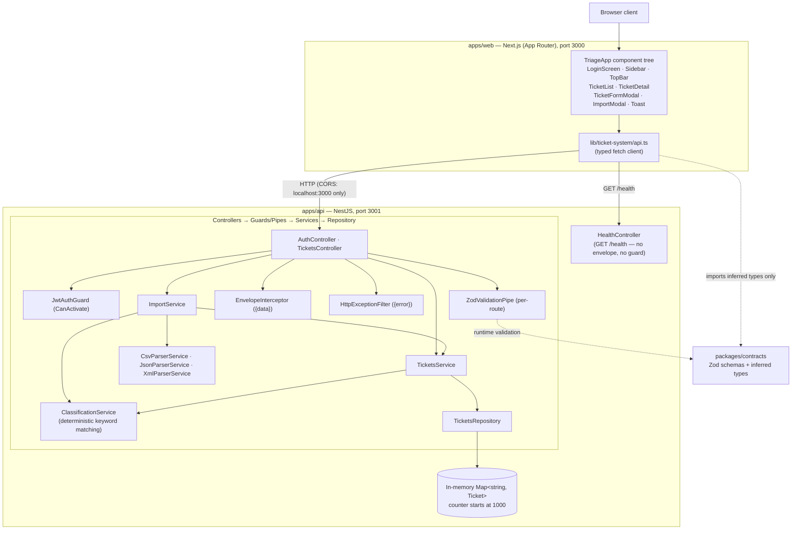
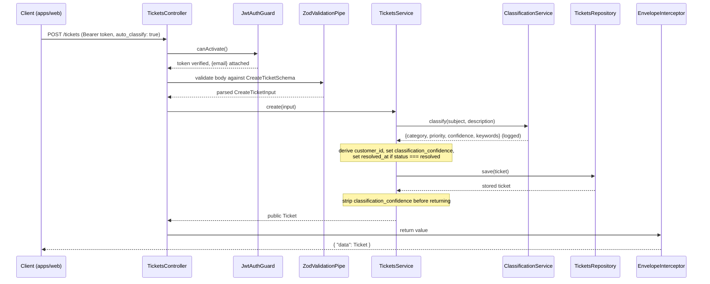
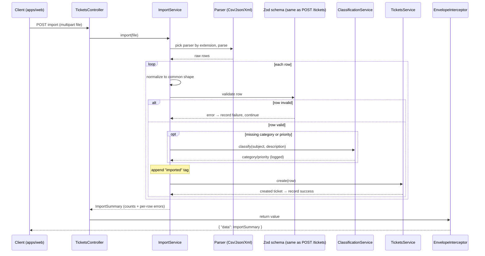

# Architecture

This document describes the architecture of the customer-support ticket system: its major components, how requests flow through them, and the design decisions (and their trade-offs) that shaped the current shape of the codebase. It is written for technical leads evaluating or extending the system.

For the endpoint and schema catalog, see [API_REFERENCE.md](./API_REFERENCE.md). For how to run the test suite and the full benchmark table, see [TESTING_GUIDE.md](./TESTING_GUIDE.md). For setup and day-to-day usage, see [README.md](./README.md).

## System overview

The system is a Pnpm + Turborepo monorepo containing two runtime processes and a shared contracts package. There is no database, no message queue, no external LLM or AI API, and no microservice fan-out — the entire backend is a single NestJS process holding its data in an in-process `Map`, and the entire frontend is a single Next.js process.

| Workspace | Role | Port |
| --- | --- | --- |
| `apps/api` | NestJS backend — the only place with business logic and storage | `3001` (env `PORT`) |
| `apps/web` | Next.js (App Router) frontend — one ticket-triage console page | `3000` |
| `packages/contracts` | Zod schemas + inferred TypeScript types, shared by both apps | — |
| `packages/eslint-config`, `packages/typescript-config` | Shared tooling config (not part of the runtime architecture) | — |

### High-level architecture

Both apps depend on `packages/contracts`, but asymmetrically: the API uses the Zod schemas for runtime validation, while the web app imports only the inferred TypeScript types and performs no runtime validation of its own.

## Components

### `packages/contracts` — the shared contract

This package is the single source of truth for the data model. It defines Zod schemas and the TypeScript types inferred from them: `Ticket`, `CreateTicketInput`, `UpdateTicketInput`, `ClassificationResult`, `ImportSummary`, `LoginInput` / `LoginResponse`, and the shared enums for `category`, `priority`, `status`, `source`, and `device_type`. Because both apps consume it, the frontend and backend cannot drift out of shape without a compile-time break.

### `apps/web` — the ticket-triage console

A single-page console rendered by the `TriageApp` component tree: `LoginScreen`, `Sidebar`, `TopBar`, `TicketList`, `TicketDetail`, `TicketFormModal`, `ImportModal`, and `Toast`, backed by small design-system primitives under `components/ticket-system/ds/`. All backend communication is funneled through one typed fetch client, `lib/ticket-system/api.ts`. The frontend holds no business logic and does no validation — it trusts the API for both.

### `apps/api` — the backend

The backend is where all logic and storage live. Its NestJS layering is described below.

#### Bootstrap and cross-cutting concerns

- **`main.ts`** boots the app with `NestFactory.create(AppModule)`, locks CORS to exactly `http://localhost:3000` (the web app's dev origin — no other browser origin may call the API), and listens on `PORT ?? 3001`.
- **`AppModule`** imports `AuthModule` and `TicketsModule`, registers `HttpExceptionFilter` globally via `APP_FILTER`, and declares `HealthController` directly (not inside a feature module). Keeping the health check out of any feature module keeps `GET /health` outside the envelope and guard system entirely — see the design decision below.
- **`common/http-exception.filter.ts`** is a global `@Catch()` filter. It converts any thrown exception — a Nest `HttpException` or a raw `Error` — into `{"error":{"message":"..."}}` at the correct status code. When the underlying message is an array (as Nest's built-in validation errors are), it joins the entries with spaces into a single string.
- **`common/envelope.interceptor.ts`** wraps successful handler results as `{"data": ...}`. It is applied per-controller (Tickets and Auth, but *not* Health) via `@UseInterceptors`, and passes `undefined` straight through untouched so a `204 No Content` DELETE has no body.
- **`common/zod-validation.pipe.ts`** is a `PipeTransform` that runs a supplied Zod schema from `@repo/contracts` against the request body or query. It is wired inline per route (`@Body(new ZodValidationPipe(Schema))`) rather than registered globally, so each route explicitly declares which schema validates it.

#### `auth/`

`AuthModule` is `@Global()` and registers `JwtModule.register({ secret: process.env.JWT_SECRET ?? 'dev-secret-change-me', signOptions: { expiresIn: '8h' } })`. `AuthService` holds exactly one hardcoded user (`admin@ignore.com`, bcrypt-hashed password `123`, hashed once at process startup); there is no signup, user store, or password reset. `AuthController` exposes only `POST /auth/login`. `JwtAuthGuard` is a hand-written `CanActivate` that reads `Authorization: Bearer <token>`, verifies it with `JwtService.verify`, attaches the decoded `{ email }` payload to the request, or throws `401`. It guards the entire `TicketsController` at the controller level via `@UseGuards`.

#### `tickets/`

`TicketsController` sits behind both `JwtAuthGuard` and `EnvelopeInterceptor`. It delegates to `TicketsService` for everything except the file-upload route, which it routes to `ImportService`.

`TicketsService` owns the business rules:

- deriving `customer_id` from `customer_name` on create;
- auto-setting `resolved_at` the moment `status` transitions into `resolved` (unless the caller supplied their own `resolved_at`);
- stripping the internal `classification_confidence` field before any ticket is returned publicly;
- optionally invoking `ClassificationService` on create when `auto_classify: true` is passed.

`TicketsRepository` is a thin wrapper over an in-process `Map<string, Ticket>` with an auto-incrementing `number` counter starting at `1000`. There is no database and no persistence across restarts.

#### `tickets/import/`

`ImportService` selects a parser by the uploaded file's extension — `CsvParserService` (via `csv-parse`), `JsonParserService` (via `JSON.parse`), or `XmlParserService` (via `fast-xml-parser`) — normalizes every row to a common shape, and validates each row with the *same* Zod schema that `POST /tickets` uses. It accumulates a summary as it goes: one bad row never aborts the rest of the file. Rows missing `category` or `priority` are routed through `ClassificationService` before being persisted, and every imported row gets an `"imported"` tag appended.

#### `tickets/classification/`

`ClassificationService.classify(subject, description)` is pure, synchronous, and deterministic. It performs keyword matching over `(subject + " " + description).toLowerCase()` — there is no ML model and no external API call. Category rules are evaluated in a fixed priority order (`account_access` → `technical_issue` → `billing_question` → `feature_request` → `bug_report` → else `"other"`), and priority rules likewise (`urgent` → `high` → `low` → else `"medium"`). Confidence is computed as `confidence = keywords.length ? min(0.95, 0.6 + 0.1 * matchedCount) : 0.5`. Every classification call is logged through Nest's `Logger` (the ticket outcome plus matched keywords). That log is the system's only audit trail for classification decisions — there is no persisted decision-history table.

## Data flows

### Create ticket with auto-classify

### Bulk import

## Design decisions and trade-offs

1. **Contract compatibility via aliases rather than one canonical scheme.** An earlier UI prototype had already fixed the working contract: `PATCH` for updates, `/classify` for classification, and the `{data}` / `{error}` envelope. Instead of choosing between that established contract and the endpoint names the assignment spec asked for, the API exposes `PUT` and `/auto-classify` as pure aliases of the same handlers. It therefore satisfies both at once. The cost is purely documentation and discoverability — two names for one behavior — not any behavioral inconsistency.

2. **Hand-rolled JWT guard instead of `passport-jwt`.** With exactly one static seeded account and no plans for registration, OAuth, or refresh tokens, a roughly 20-line `CanActivate` built directly on `@nestjs/jwt`'s `sign` / `verify` was judged sufficient. The trade-off: it does not extend gracefully. If real multi-user auth is ever needed, this guard would likely be replaced wholesale rather than grown incrementally.

3. **Zod over class-validator.** `packages/contracts` was already the shared schema/type package consumed by both apps before this feature existed. Reusing it through a custom `ZodValidationPipe` avoids introducing a second, backend-only validation mechanism (class-validator decorators) that would duplicate a shape already defined in Zod. The trade-off: Nest's more idiomatic DTO + class-validator pipeline — and its automatic Swagger-generation story — is not used.

4. **In-memory `Map` instead of a real database.** An explicit homework-scope decision. The consequence is zero persistence across restarts and no external locking or transactions. Because Node is single-threaded, though, a plain `Map` is inherently safe under concurrent request handling — there are no torn writes — which is why the 20-concurrent-request integration test passes with no added synchronization code. This design would not survive a move to a multi-process or horizontally scaled deployment without introducing a real datastore.

5. **`classification_confidence` tracked internally, never exposed publicly.** This keeps the public `Ticket` response shape identical to the assignment's model (which has no confidence field) while still satisfying the "store classification confidence" requirement. The field is set whenever classification runs (manually or via auto-classify) and is simply never serialized back out.

6. **`/health` deliberately outside the envelope, guard, and versioning system.** Declaring `HealthController` directly on `AppModule` — unwrapped and unauthenticated — insulates infrastructure health checks from any future change to the ticket API's auth or response contract. They keep working unchanged regardless of what happens to the rest of the API.

## Security considerations

- **JWT secret default.** `JWT_SECRET` falls back to the insecure literal `'dev-secret-change-me'` when unset. **Setting a real secret is a hard requirement before any production deployment** — otherwise tokens are trivially forgeable.
- **Token lifetime.** Tokens expire after 8 hours with no refresh mechanism; a client simply re-authenticates.
- **Single hardcoded account.** There is one static user and no registration or password-reset surface — which means less attack surface, but also no account lifecycle (no rotation, revocation, or additional users) without code changes.
- **CORS.** Locked to exactly `http://localhost:3000`. Any other deployed origin requires updating the allow-list in `main.ts`.
- **No login rate limiting.** `POST /auth/login` has no throttling, so brute-force attempts are not mitigated at the application layer.
- **No HTTPS enforcement.** The app assumes it sits behind a TLS-terminating proxy in any real deployment; it does not enforce transport security itself.

## Performance considerations

Because tickets live in an in-memory `Map`, list and filter operations are O(n) over all tickets. This is fine at homework and demo scale, but at production scale it would require indexing or a real database with query support.

The performance suite in `apps/api/test/performance.e2e-spec.ts` asserts the current characteristics:

| Scenario | Asserted threshold |
| --- | --- |
| List 200 tickets | < 1000 ms |
| Import 100 CSV rows | < 2000 ms |
| Classify one ticket | < 200 ms |
| 20 concurrent `GET /tickets` | < 1500 ms total |
| Filter a 100-ticket dataset | < 500 ms |

See [TESTING_GUIDE.md](./TESTING_GUIDE.md) for the full benchmark table and test setup rather than re-deriving it here.

*This document was generated with Claude Opus 4.8.*
