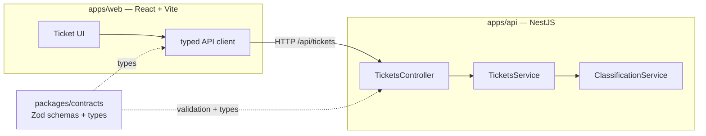

# 🎧 Support Tickets — Turborepo Monorepo

A [Turborepo](https://turbo.build/repo) monorepo for the Intelligent Customer Support System:
a **React** frontend and a **NestJS** backend that share a single, type-safe **contracts**
package (Zod schemas → inferred TypeScript types) used for validation on the server and
typing on the client.

## Architecture



The `@repo/contracts` package is the single source of truth. The API validates every request
body against its Zod schemas; the web app imports the inferred types so a change to the shape
of a ticket surfaces as a compile error on **both** sides.

## Workspace layout

```
homework-2/
├── apps/
│   ├── api/          # NestJS REST API (tickets CRUD + auto-classification)
│   └── web/          # React + Vite single-page app
├── packages/
│   ├── contracts/    # Zod schemas + inferred types (shared domain model)
│   └── eslint-config/# Shared ESLint flat configs (base / react / nest)
├── turbo.json        # Turborepo task pipeline
├── pnpm-workspace.yaml
└── tsconfig.base.json
```

## Prerequisites

- Node.js ≥ 20
- [pnpm](https://pnpm.io) 10 (`corepack enable` will provide it)

## Getting started

```bash
pnpm install        # install all workspaces
pnpm build          # build contracts → api & web (respects the dependency graph)
pnpm dev            # run api (http://localhost:3001/api) + web (http://localhost:5173)
```

`pnpm dev` starts both apps in parallel via Turborepo. The Vite dev server proxies `/api`
to the NestJS backend, so there is no CORS to configure locally.

## Common commands

| Command | Description |
|---|---|
| `pnpm dev` | Run all apps in watch mode |
| `pnpm build` | Build every workspace (topological order) |
| `pnpm test` | Run all test suites |
| `pnpm lint` | Lint every workspace |
| `pnpm type-check` | Type-check every workspace |

Target a single workspace with `--filter`, e.g. `pnpm --filter @repo/api dev`.

## API

Base URL: `http://localhost:3001/api`

| Method | Endpoint | Description |
|---|---|---|
| `GET` | `/health` | Liveness probe |
| `POST` | `/tickets` | Create a ticket (`auto_classify: true` to classify on create) |
| `POST` | `/tickets/import` | Bulk import from a JSON `records` array → import summary |
| `GET` | `/tickets` | List tickets (filter by `category`, `priority`, `status`, `assigned_to`, `search`) |
| `GET` | `/tickets/:id` | Fetch one ticket |
| `PUT` | `/tickets/:id` | Update a ticket |
| `DELETE` | `/tickets/:id` | Delete a ticket (`204`) |
| `POST` | `/tickets/:id/auto-classify` | Run keyword classification and persist the result |

Tickets are held in memory (`Map`) for now — swap `TicketsService` for a real repository
(Prisma/TypeORM) without touching the controller or the contracts.

## Adding to the shared contract

Edit the Zod schemas in [`packages/contracts/src`](packages/contracts/src), then rebuild:

```bash
pnpm --filter @repo/contracts build
```

Both apps pick up the new types automatically (run `pnpm --filter @repo/contracts dev` to
rebuild on change while developing).
