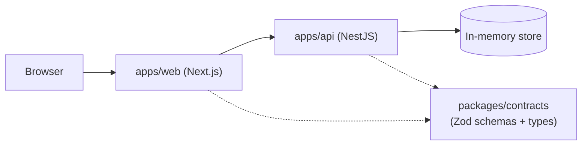

# Intelligent Customer Support System

> **Student Name**: Volodymyr Kiryakov
> **Date Submitted**: 2026-07-13
> **AI Tools Used**: Claude Code + Claude Design

A customer support ticket management system: import tickets from CSV/JSON/XML, auto-classify them with keyword-based rules, and manage the whole queue through a REST API and a Next.js triage console.

This is a pnpm/Turborepo monorepo with two apps (`api`, `web`) sharing a single contracts package for validation and types.

## Documentation

- [API_REFERENCE.md](./API_REFERENCE.md) — endpoint-by-endpoint reference for API consumers integrating with the NestJS backend.
- [ARCHITECTURE.md](./ARCHITECTURE.md) — system design and technical decisions, for technical leads evaluating the codebase.
- [TESTING_GUIDE.md](./TESTING_GUIDE.md) — how the test suites are organized and how to run them, for QA engineers.

## Features

- **Ticket CRUD** — create, read, update, and delete support tickets via a REST API.
- **Bulk import** — upload a CSV, JSON, or XML file to create many tickets in one request.
- **Rule-based auto-classification** — a keyword-driven classifier (no external LLM call) assigns each ticket a category, priority, confidence score, and human-readable reasoning.
- **Triage console UI** — a Next.js single-page app for logging in, browsing/filtering tickets, creating and editing tickets with client-side validation, importing files, and triggering classification with visual feedback.

## Architecture



`apps/web` and `apps/api` both depend on `packages/contracts` for shared Zod schemas and inferred TypeScript types, so validation rules and data shapes stay in sync across the frontend and backend. The API keeps all ticket data in memory only — there is no database and no persistence across restarts, a deliberate scope choice for this homework. See [ARCHITECTURE.md](./ARCHITECTURE.md) for request-level detail.

## Getting Started

### Prerequisites

- Node.js >= 22
- pnpm 10.16.1 (the version pinned via `packageManager` in the root `package.json`)

### Setup

1. Install dependencies from the repo root:

   ```bash
   pnpm install
   ```

2. Copy the environment templates (the defaults work out of the box for local dev):

   ```bash
   cp apps/api/.env.example apps/api/.env
   cp apps/web/.env.example apps/web/.env
   ```

   - `apps/api/.env` sets `PORT=3001` for the NestJS server.
   - `apps/web/.env` sets `NEXT_PUBLIC_API_URL=http://localhost:3001` so the frontend knows where to reach the API.

3. Start both apps in dev mode from the repo root (Turborepo runs them concurrently):

   ```bash
   pnpm dev
   ```

   This starts the API on [http://localhost:3001](http://localhost:3001) and the web app on [http://localhost:3000](http://localhost:3000).

4. Open [http://localhost:3000](http://localhost:3000) and log in with the seeded account:

   - Email: `admin@ignore.com`
   - Password: `123`

   There is no self-registration — this single seeded account is the only login.

## Testing

Run the full workspace test suite via Turborepo from the repo root:

```bash
pnpm test
```

Or target the API package directly:

```bash
pnpm --filter api test        # unit tests (15 suites / 95 tests)
pnpm --filter api test:cov    # unit tests with coverage report (~90% coverage)
pnpm --filter api test:e2e    # end-to-end / integration tests
```

See [TESTING_GUIDE.md](./TESTING_GUIDE.md) for the full breakdown of test suites and coverage.

## Other root scripts

```bash
pnpm build    # build all apps/packages via Turborepo
pnpm lint     # lint all apps/packages via Turborepo
pnpm format   # format the repo with Prettier
```

## Project Structure

```text
homework-2/
├── apps/
│   ├── api/            # NestJS backend — REST API, port 3001 default
│   └── web/            # Next.js frontend (App Router) — port 3000 default
├── packages/
│   ├── contracts/      # @repo/contracts — shared Zod schemas + inferred TS types, used by both api and web
│   ├── eslint-config/   # shared ESLint configuration
│   └── typescript-config/ # shared tsconfig bases
├── docs/
│   ├── screenshots/    # UI screenshots used in the docs
│   └── superpowers/    # internal planning specs, not user-facing
├── API_REFERENCE.md
├── ARCHITECTURE.md
├── TESTING_GUIDE.md
└── README.md           # this file
```

---

*This document was generated with Claude Sonnet 5.*
