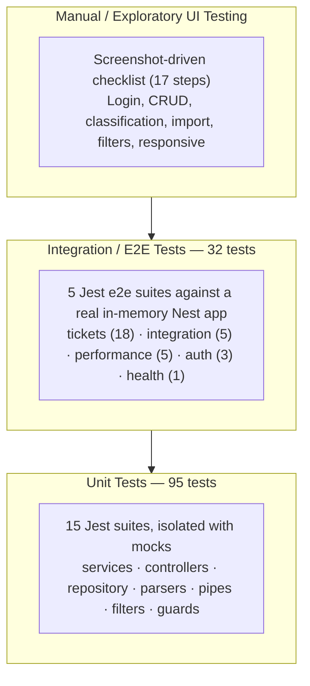
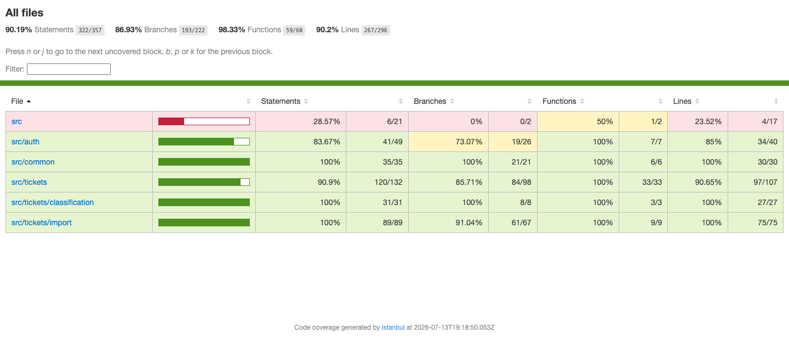

# Testing Guide

QA guide for the customer support ticket system backend (NestJS, `apps/api`). It covers the automated test suites (unit + integration/e2e), performance benchmarks, sample test data, and a manual UI testing checklist.

Related documentation:

- [README.md](README.md) — project overview and setup
- [API_REFERENCE.md](API_REFERENCE.md) — endpoint contracts (useful when writing new e2e assertions or testing manually with curl/Postman)
- [ARCHITECTURE.md](ARCHITECTURE.md) — system design and module layout

---

## 1. Test Pyramid



- **Base (widest): 95 unit tests** — fast, isolated, run on every change. Cover business logic (ticket service, classification rules, import parsers), HTTP plumbing (controllers, validation pipe, exception filter, envelope interceptor), and auth (service, guard).
- **Middle: 32 integration/e2e tests** — boot the full Nest application in memory and exercise real HTTP requests end to end, including auth boundaries, import flows, concurrency, and performance gates.
- **Top (narrowest): manual/exploratory UI testing** — the checklist in section 5, backed by reference screenshots in `docs/screenshots/`.

Current coverage (unit tests, last verified run): **statements 90.19%, branches 86.93%, functions 98.33%, lines 90.20%** — above the 85% project target.

---

## 2. How to Run the Tests

All commands run from the **repository root** unless noted otherwise.

### 2.1 Unit tests

```bash
pnpm --filter api test
```

Runs every `apps/api/src/**/*.spec.ts` file with Jest. Expected result: **15 suites, 95 tests, all passing**. Any failure prints the failing assertion with a diff — the suite/file name in the output tells you which module regressed.

### 2.2 Unit tests with coverage

```bash
pnpm --filter api test:cov
```

Same as above, plus a coverage report:

- A **text summary table** is printed to the terminal — one row per file with `% Stmts / % Branch / % Funcs / % Lines`. The project target is **85%** on each overall metric; the current run exceeds it (see section 1).
- An **HTML report** is written to `apps/api/coverage/lcov-report/index.html`. Open that file in a browser for the annotated per-line view — red-highlighted lines were never executed by any test, which is the fastest way to spot untested branches when reviewing a fix.



### 2.3 Integration / e2e tests

```bash
pnpm --filter api test:e2e
```

Runs every `apps/api/test/**/*.e2e-spec.ts` file (Jest config: `apps/api/test/jest-e2e.json`) against a **real running Nest app instance** (in-memory — no external server or database needs to be started first). Expected result: **5 suites, 32 tests, all passing**. This includes the performance benchmarks (section 6), so a pass also confirms the latency gates.

E2E suite map — use this to know which suite to re-run when verifying a specific fix:

| Suite | Tests | Covers |
|---|---|---|
| `test/tickets.e2e-spec.ts` | 18 | Full ticket CRUD over HTTP, classify/auto-classify aliases, import happy + error paths, auth rejection, repeated-status-query-param regression |
| `test/integration.e2e-spec.ts` | 5 | Full lifecycle (create → classify → update → resolve → delete), bulk import + auto-classification verification, 20 concurrent ticket creations, combined category+priority filtering, auth boundary (login open, tickets protected) |
| `test/performance.e2e-spec.ts` | 5 | Performance benchmarks (see section 6) |
| `test/auth.e2e-spec.ts` | 3 | Login success, wrong password, malformed login body |
| `test/app.e2e-spec.ts` | 1 | `GET /health` |

### 2.4 Everything at once (monorepo)

```bash
pnpm test
```

Runs `test` in every workspace package via Turborepo — the api unit tests plus any tests in `packages/contracts` (schema-level tests in `packages/contracts/src/ticket.spec.ts`). Note this does **not** include the e2e suite; run `test:e2e` separately.

### 2.5 Re-running a single suite (verifying a specific fix)

From `apps/api`:

```bash
# One unit suite
npx jest src/tickets/tickets.service.spec.ts

# One e2e suite
npx jest --config test/jest-e2e.json test/tickets.e2e-spec.ts

# Watch mode — re-runs affected tests on every file save
npx jest --watch
```

Tip: add `-t "part of the test name"` to any of the above to run a single test case within a suite.

### 2.6 Unit suite map

| Suite | Tests | Area |
|---|---|---|
| `src/tickets/tickets.service.spec.ts` | 19 | Ticket business logic |
| `src/tickets/tickets.controller.spec.ts` | 10 | Ticket HTTP endpoints |
| `src/tickets/classification/classification.service.spec.ts` | 10 | Rule-based auto-classification |
| `src/tickets/import/import.service.spec.ts` | 9 | Import orchestration, partial failures |
| `src/tickets/tickets.repository.spec.ts` | 8 | Persistence layer |
| `src/tickets/import/xml-parser.service.spec.ts` | 7 | XML import parsing |
| `src/tickets/import/csv-parser.service.spec.ts` | 6 | CSV import parsing |
| `src/common/http-exception.filter.spec.ts` | 6 | Error response shaping |
| `src/tickets/import/json-parser.service.spec.ts` | 5 | JSON import parsing |
| `src/common/zod-validation.pipe.spec.ts` | 4 | Request validation |
| `src/auth/jwt-auth.guard.spec.ts` | 3 | JWT guard |
| `src/auth/auth.service.spec.ts` | 3 | Credential verification, token issuing |
| `src/common/envelope.interceptor.spec.ts` | 3 | Response envelope |
| `src/auth/auth.controller.spec.ts` | 1 | Login endpoint |
| `src/health.controller.spec.ts` | 1 | Health check |

---

## 3. Sample Test Data

Fixture files consumed by the automated import tests live at `apps/api/test/fixtures/`:

| File | Purpose |
|---|---|
| `tickets-valid.csv` | Well-formed sample tickets in CSV — import happy path |
| `tickets-valid.json` | Well-formed sample tickets in JSON — import happy path |
| `tickets-valid.xml` | Well-formed sample tickets in XML — import happy path |
| `tickets-malformed.csv` | Deliberately broken CSV rows — trips row-level field validation and exercises per-row error reporting |
| `tickets-malformed.json` | Deliberately broken JSON entries — trips schema validation and exercises partial-import behavior (valid entries import, bad ones are reported) |
| `tickets-malformed.xml` | Deliberately broken XML records — trips XML parsing/validation and exercises the per-record error summary |

These same files are convenient for manual testing of the import modal (checklist steps 10–12 below): upload a `tickets-valid.*` file to see a clean import, then a `tickets-malformed.*` file to verify the partial-failure summary is surfaced in the UI.

Larger standalone datasets also live at the repo root, generated for volume/demo testing and verified against a live import run (each import returned zero failed rows):

| File | Rows | Purpose |
| --- | --- | --- |
| `sample_tickets.csv` | 50 | Larger-volume CSV import demo — mixes tickets with explicit `category`/`priority` and tickets that omit them (so auto-classification runs on import) |
| `sample_tickets.json` | 20 | Same idea, JSON format |
| `sample_tickets.xml` | 30 | Same idea, XML format |
| `sample_tickets_invalid.csv` / `.json` / `.xml` | 8 each (1 valid + 7 invalid) | Syntactically well-formed files whose rows fail Zod validation in different ways — missing `subject`, missing `customer_name`, malformed email, description under 10 chars, subject over 200 chars, invalid `category` enum value, invalid `priority` enum value. Complements `tickets-malformed.*` above (which test unparsable syntax) by testing the "parses fine, fails validation" path — importing any of them returns `imported_count: 1, failed_count: 7` with one precise per-row error message per violation. |

---

## 4. Manual Testing Checklist

Prerequisites: both apps running (see [README.md](README.md) for startup instructions). Test credentials: **`admin@ignore.com` / `123`**.

Each step references the screenshot from a prior verified pass in `docs/screenshots/` so you can compare against the expected state.

### Authentication

- [ ] Open the app while logged out — the login screen is shown (`docs/screenshots/01-login.png`)
- [ ] Submit **invalid** credentials — an error message is displayed and no session starts (`docs/screenshots/02-login-error.png`)
- [ ] Submit **valid** credentials (`admin@ignore.com` / `123`) — login succeeds and the app loads (`docs/screenshots/03-login-success.png`)

### Ticket queue and creation

- [ ] With no tickets, the queue shows an empty state (`docs/screenshots/04-queue-empty.png`)
- [ ] Click "New Ticket" — the creation modal opens (`docs/screenshots/05-new-ticket-modal.png`)
- [ ] Try submitting the modal with missing/invalid fields — client-side validation errors are shown and the form does not submit
- [ ] Fill in all fields with valid data (`docs/screenshots/06-new-ticket-filled.png`) and submit — the new ticket appears in the queue
- [ ] Click the ticket — the detail view shows all submitted fields correctly (`docs/screenshots/07-ticket-detail.png`)

### Classification

- [ ] Trigger classification on a ticket — the result shows **category, priority, confidence, and reasoning**, all populated (`docs/screenshots/08-classification.png`)

### Import

- [ ] Open the import modal (`docs/screenshots/09-import-modal.png`)
- [ ] Select a file — the chosen file is displayed before upload (`docs/screenshots/10-import-file-selected.png`)
- [ ] Import each of the three valid formats in turn (`apps/api/test/fixtures/tickets-valid.csv`, `.json`, `.xml`) — imported tickets appear in the queue after each (`docs/screenshots/11-after-import.png`)
- [ ] Import a malformed file (e.g. `tickets-malformed.csv`) — the partial-failure summary is surfaced (how many rows imported, how many failed and why); valid rows are still imported

### Filtering

- [ ] Filter the list by **status** — only matching tickets are shown
- [ ] Filter by **priority** — only matching tickets are shown
- [ ] Filter by **category** — only matching tickets are shown; combining filters narrows results further

### Deletion

- [ ] Delete a ticket — a confirmation prompt appears first (`docs/screenshots/12-delete-confirm.png`); confirming removes the ticket from the queue

### Responsive layout

- [ ] Narrow the viewport (or use device emulation) — the ticket list adapts to mobile (`docs/screenshots/13-mobile-list.png`)
- [ ] The navigation drawer works on mobile (`docs/screenshots/14-mobile-drawer.png`)
- [ ] Ticket detail is usable on mobile (`docs/screenshots/15-mobile-detail.png`)
- [ ] At desktop width the full overview layout renders correctly (`docs/screenshots/16-desktop-overview.png`)

### Logout

- [ ] Log out — the session ends and the login screen is shown again; protected pages are no longer accessible (`docs/screenshots/17-after-logout.png`)

---

## 5. Performance Benchmarks

These are **hard pass/fail assertions** in `apps/api/test/performance.e2e-spec.ts` — if any threshold is exceeded, the e2e suite (and CI) fails. They are not aspirational targets.

| Benchmark | Threshold |
|---|---|
| List 200 tickets | < 1000 ms |
| Import 100 CSV rows | < 2000 ms |
| Classify a single ticket | < 200 ms |
| 20 concurrent `GET /tickets` requests | < 1500 ms total |
| Filter a 100-ticket dataset | < 500 ms |

To re-run: `pnpm --filter api test:e2e` executes `performance.e2e-spec.ts` along with the rest of the e2e suite. To run only the benchmarks: `cd apps/api && npx jest --config test/jest-e2e.json test/performance.e2e-spec.ts`.

> Note: thresholds are measured on the in-memory test app. Results on a heavily loaded CI machine can vary; a marginal failure is worth one re-run before investigating as a regression.

---

*This document was generated with Claude Fable 5.*
