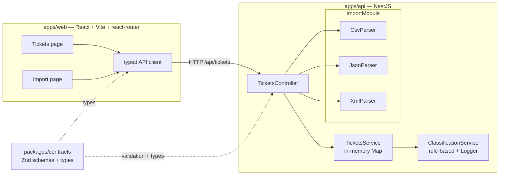
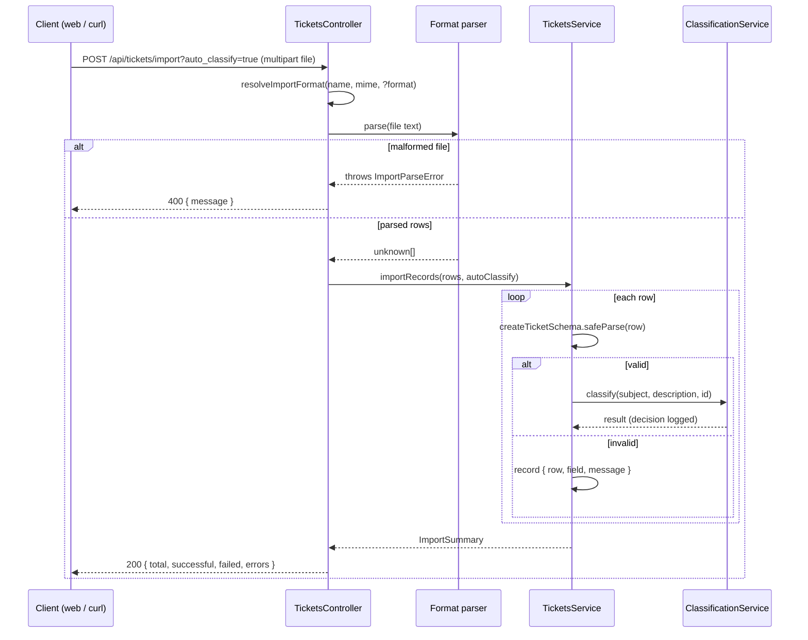
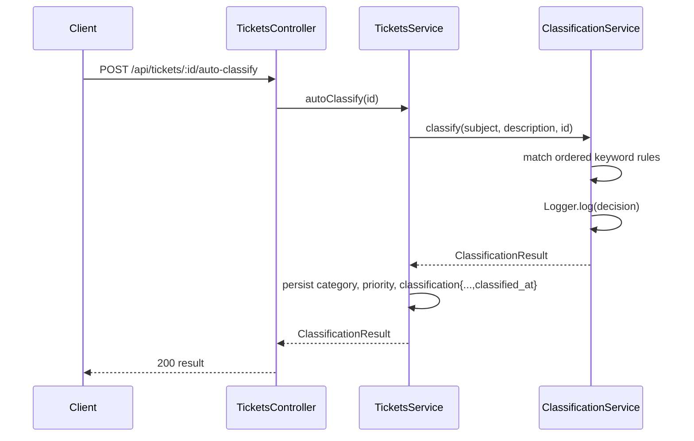

# Architecture

Technical overview of the Support Ticket System for engineers extending or operating the codebase. For endpoint-level request/response details, see [`docs/API_REFERENCE.md`](./API_REFERENCE.md); this document does not duplicate its tables.

## 1. High-level architecture

This is a pnpm/Turborepo monorepo with three workspace packages: `@repo/web` (React 19 + Vite + react-router), `@repo/api` (NestJS), and `@repo/contracts` (shared Zod schemas), consumed by both apps.

## 2. Components

**`packages/contracts`** is the single source of truth for every data shape crossing the API boundary — `Ticket`, `CreateTicketInput`, `UpdateTicketInput`, `ListTicketsQuery`, `ClassificationResult`/`TicketClassification`, `ImportFormat`/`ImportSummary`/`ImportError`, and the domain enums (`TICKET_CATEGORIES`, `TICKET_PRIORITIES`, `TICKET_STATUSES`, `TICKET_SOURCES`, `DEVICE_TYPES`). Each schema is a Zod object (mostly `.strict()`) with the TypeScript type inferred via `z.infer<>`, so the runtime validator and the compile-time type can never drift apart. The package builds with `tsup` into a dual ESM/CJS bundle (`dist/index.js` + `dist/index.cjs`, with matching `.d.ts`/`.d.cts`), so it can be `import`ed by the Vite-bundled web app and `require`d/imported by the Node-run API identically.

**`TicketsController` + `ZodValidationPipe`** (`apps/api/src/tickets/tickets.controller.ts`, `apps/api/src/common/zod-validation.pipe.ts`) is the HTTP surface. Each mutating route wraps its `@Body()`/`@Query()` in `new ZodValidationPipe(schema)`, which calls `schema.parse(value)` and turns a `ZodError` into a `BadRequestException({ message: 'Validation failed', errors })` — a generic, reusable pipe rather than per-route hand validation. The controller itself is thin: it resolves the import format, dispatches to the right parser, and delegates all persistence and business logic to `TicketsService`.

**`ImportModule` parsers + `ImportParseError`** (`apps/api/src/import/*.ts`) convert CSV, JSON, and XML file bodies into arrays of loosely-typed records that are later validated row-by-row against `createTicketSchema`. `CsvParserService` uses `papaparse` with a required header row, pipe-separated `tags`, and `metadata_*` column nesting; `JsonParserService` accepts a bare array or a `{ records: [...] }` envelope; `XmlParserService` uses `fast-xml-parser` and expects `<tickets><ticket>…</ticket></tickets>`. All three throw the shared `ImportParseError` for file-level failures (empty content, malformed syntax, wrong top-level shape) — a single error type the controller catches and maps to `400`, distinct from row-level content problems, which are never treated as parse errors. `resolveImportFormat` (`import-format.ts`) picks the format via `?format=` override → file extension → MIME type, in that precedence order.

**`TicketsService`** (`apps/api/src/tickets/tickets.service.ts`) is the persistence and orchestration layer, backed today by a private `Map<string, Ticket>`. Its constructor comment documents the intended repository seam: "swap the `Map` for a real repository (Prisma/TypeORM) without changing the controller contract" — the controller only calls `create`/`findAll`/`findOne`/`update`/`remove`/`autoClassify`/`importRecords`, none of which leak the storage mechanism. `importRecords` runs each parsed row through `createTicketSchema.safeParse`, calling `create()` (which optionally invokes the classifier) for every row that validates and appending a `{ row, field, message }` entry to `ImportSummary.errors` for every row that doesn't, so one bad row never fails the batch.

**`ClassificationService`** (`apps/api/src/tickets/classification.service.ts`) is a deterministic, rule-based classifier with an injected `Logger`. Category rules are evaluated in a fixed order — `account_access` → `billing_question` → `bug_report` → `technical_issue` → `feature_request` — against a lower-cased `subject\ndescription` haystack, and the first rule with any keyword hit wins (falling back to `'other'` if none match); priority rules (`urgent` → `high` → `low`, default `medium`) follow the same first-match pattern independently. Confidence is `min(0.95, 0.5 + 0.15 × distinct matched keywords)`, floored at `0.3` when nothing matches at all. Every classification call logs the ticket id, resolved category/priority/confidence, and matched keywords via `Logger.log`, and returns a `ClassificationResult` that `TicketsService` persists as **provenance** on the ticket's `classification` field — the classifier's opinion is recorded even when explicit `category`/`priority` in the request payload took precedence over it.

**Web app pages** (`apps/web/src/pages/*.tsx`) are routed by react-router: `TicketsPage` at `/` renders a creation form and a filterable/searchable list (calling `ticketsApi.list/create/remove/autoClassify`), and `ImportPage` at `/import` provides a drag-and-drop / click-to-browse uploader that posts a file through `ticketsApi.importFile` and renders the returned `ImportSummary` (totals plus a per-row error table). Both pages go through the typed client in `apps/web/src/api/client.ts`, which wraps `fetch`, prefixes requests with `VITE_API_URL` (default `/api`), and throws on non-OK responses using the server's `message` field.

## 3. Data flow

### Bulk import (`POST /tickets/import`)

### Auto-classify an existing ticket (`POST /tickets/:id/auto-classify`)

Both flows converge on the same `ClassificationService.classify()` call and the same persistence shape (`category`, `priority`, and a `classification` provenance object stamped with `classified_at`), so a ticket's classification history looks identical whether it arrived via a single `POST /tickets`, a bulk import, or an explicit re-classify call.

## 4. Design decisions & trade-offs

- **In-memory `Map` for storage.** Zero setup, zero external dependencies, and fast enough for the tests and the demo — but data is lost on every server restart and there's no concurrency control beyond JavaScript's single-threaded event loop. `TicketsService` documents the intended repository seam in its class comment; the controller depends only on the service's method signatures, so swapping in Prisma/TypeORM later is a localized change, not a rewrite.
- **Rule-based classifier vs. ML.** Keyword matching over an ordered rule list is deterministic, fully explainable (the `reasoning` and `keywords_found` fields trace exactly why a decision was made), free to run, and trivial to unit test. The trade-off is an accuracy ceiling: it cannot generalize past its keyword lists, has no notion of context or negation, and will always call an unmatched ticket `'other'`/`'medium'` regardless of actual severity. A future ML-based classifier could replace it behind the same `ClassificationResult` contract.
- **Shared Zod contracts (`@repo/contracts`).** Defining each schema once and inferring both the runtime validator and the TypeScript type means a single edit (e.g. adding a ticket field) surfaces as a type error everywhere it's used — API controller, service, and web client alike — instead of silently drifting. The cost is a build step: because both apps consume `packages/contracts/dist`, changes there require running the package's `tsup` build (or `pnpm dev` in watch mode) before consumers pick them up.
- **Multipart upload vs. raw JSON body for import.** `POST /tickets/import` accepts `multipart/form-data` with a `file` field (via `@nestjs/platform-express`'s `FileInterceptor`) rather than requiring callers to embed file contents in a JSON body. This gives real file semantics — a filename and MIME type for format detection, a natural fit for `<input type="file">`/drag-and-drop on the web, and a size limit enforced by the multipart layer itself — at the cost of pulling in `multer` (via the Express platform) as a runtime dependency and requiring `curl -F` rather than a plain `-d` JSON payload for manual testing.
- **Strict schemas (`.strict()`) everywhere.** Rejecting unknown keys catches typos and stale client payloads early (a misspelled field fails validation loudly instead of being silently dropped), which matters most for a system with distributed clients (web app, CSV/JSON/XML importers, curl). The trade-off is reduced flexibility: any deliberate schema evolution (adding an optional field) must happen in `packages/contracts` first, and importers must not introduce speculative extra columns/keys the schema doesn't already know about.

## 5. Security considerations

- **1 MB upload cap.** `FileInterceptor('file', { limits: { fileSize: 1024 * 1024 } })` rejects oversized uploads before they reach any parser, guarding against large-payload denial-of-service via the import endpoint (enforced by Multer, surfaced to the client as `413 Payload Too Large`).
- **Strict schema rejection of unknown fields.** Every request-body/query Zod schema is `.strict()`, so unexpected keys are treated as validation errors rather than being silently accepted or persisted — this closes off a class of injection/pollution attempts via extra JSON fields.
- **No authentication or authorization.** There is no login, session, API key, or per-user access control anywhere in the system; every endpoint is open to any caller who can reach the API. This is a deliberate scope limitation for this homework deliverable, not an oversight — a production deployment would need an auth layer (e.g. JWT/session middleware plus per-route guards) in front of `TicketsController`.
- **CORS restricted to the web origin.** `apps/api/src/main.ts` calls `app.enableCors({ origin: corsOrigin })` where `corsOrigin` defaults to `http://localhost:5173` and is overridable via the `CORS_ORIGIN` environment variable — the API does not accept cross-origin requests from arbitrary origins by default.
- **No secrets in the repository.** The API takes its configuration (`PORT`, `CORS_ORIGIN`) from environment variables with safe local defaults; there are no API keys, credentials, or connection strings committed to source control, since the current implementation has no external services to authenticate against.

## 6. Performance considerations

- **Synchronous in-memory operations.** Every `TicketsService` method (`create`, `findAll`, `update`, `remove`, `importRecords`) operates directly on the in-memory `Map` with no I/O latency, which is why the API can process large imports quickly today — but it also means the entire dataset must fit in process memory and every operation is single-threaded and blocking within Node's event loop.
- **O(n) list filtering.** `findAll` copies all tickets out of the `Map` (`[...this.tickets.values()]`) and applies `category`/`priority`/`status`/`assigned_to`/`search` filters as sequential `Array.filter` passes, then sorts by `created_at`. This is O(n) per filter field and O(n log n) for the sort — fine at the dataset sizes exercised by the tests and sample fixtures, but it would need indexing (or a real query engine) to stay fast at large scale.
- **Parser costs.** CSV/JSON/XML parsing (`papaparse`, `JSON.parse`, `fast-xml-parser`) each run once per import request over the full file body held in memory; relative costs and pass/fail thresholds for these paths, along with the other measured benchmarks, are tracked in `docs/TESTING_GUIDE.md`'s performance section rather than duplicated here.
- **Where a database/queue would slot in.** The repository seam documented on `TicketsService` is the natural point to introduce a real database (e.g. Postgres via Prisma) for durability and indexed queries once `findAll`'s filters need to scale past what in-memory scanning can handle. Large imports are currently processed synchronously within the HTTP request; a queue (e.g. BullMQ backed by Redis) processing `importRecords` asynchronously — with the client polling or receiving a webhook for the resulting `ImportSummary` — would be the natural next step if import files grow large enough that request-timeout limits become a concern.

---

> _Generated with Claude Fable 5 (claude-fable-5)._
