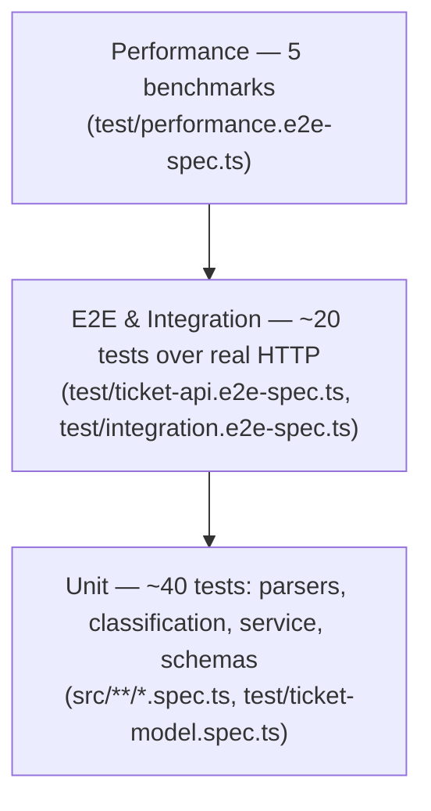

# Testing Guide

Reference for QA engineers validating the Support Ticket System — how the automated suites are organized, how to run them, what sample data exists, and a manual smoke-test checklist for the running app. For endpoint contracts see [`docs/API_REFERENCE.md`](./API_REFERENCE.md); for system design see [`docs/ARCHITECTURE.md`](./ARCHITECTURE.md).

## 1. Test pyramid



All suites run in a single Jest invocation (`apps/api/jest.config.js` defines two Jest **projects**: `unit`, for specs colocated under `src/`, and `e2e`, for `test/*.spec.ts` and `test/*.e2e-spec.ts`). Coverage is merged across both projects from `src/` production files, excluding `main.ts` (bootstrap-only) and `*.spec.ts` files.

## 2. How to run

Run everything from the monorepo root (`homework-2/`):

| Command | What it does |
|---|---|
| `pnpm test` | Runs `test` in every workspace via Turborepo (currently only `@repo/api` has tests). |
| `pnpm --filter @repo/api test` | Runs the API's full Jest suite (both `unit` and `e2e` projects). |
| `pnpm --filter @repo/api test -- csv-parser` | Runs only suites whose file path matches `csv-parser` (Jest's positional pattern argument) — swap in any substring, e.g. `ticket-api`, `performance`, `classification`. |
| `pnpm --filter @repo/api test:cov` | Runs the full suite with coverage collection and prints the coverage table. |

**Coverage is enforced, not advisory.** `test:cov` fails the run if merged coverage drops below the `coverageThreshold` in `apps/api/jest.config.js`:

- Lines: **85%**
- Statements: **85%**
- Functions: **85%**
- Branches: **80%**

As of the latest run, actual coverage is **96.94% statements / 92.39% branches / 95.45% functions / 98.6% lines** — comfortably above every threshold — across **87 tests in 10 suites**, all passing.

## 3. Suite map

The table below maps the suite names required by `TASKS.md` (Task 3) to the actual spec files, with real test counts from the current codebase (verified by counting `it(`/`test(` blocks in each file). All suites meet or exceed their assignment minimum.

| Required suite | Actual file | Test count | Assignment minimum |
|---|---|---|---|
| `test_ticket_api` | `apps/api/test/ticket-api.e2e-spec.ts` | 15 | 11 |
| `test_ticket_model` | `apps/api/test/ticket-model.spec.ts` | 11 | 9 |
| `test_import_csv` | `apps/api/src/import/csv-parser.spec.ts` | 10 | 6 |
| `test_import_json` | `apps/api/src/import/json-parser.spec.ts` | 5 | 5 |
| `test_import_xml` | `apps/api/src/import/xml-parser.spec.ts` | 7 | 5 |
| `test_categorization` | `apps/api/src/tickets/classification.service.spec.ts` | 13 | 10 |
| `test_integration` | `apps/api/test/integration.e2e-spec.ts` | 5 | 5 |
| `test_performance` | `apps/api/test/performance.e2e-spec.ts` | 5 | 5 |

Two additional suites exist beyond the required list and round out the 10 suites / 87 tests total: `apps/api/src/import/import-format.spec.ts` (5 tests, covers format-resolution precedence — extension vs. MIME type vs. explicit `?format=`) and `apps/api/src/tickets/tickets.service.spec.ts` (11 tests, covers the in-memory service's CRUD/filtering logic directly, beneath the HTTP layer exercised by `test_ticket_api`).

## 4. Sample data

Fixtures live under `apps/api/test/fixtures/` and are consumed by the import/integration/e2e/performance suites, and are also usable directly for manual testing via the `/import` page.

| File | Format | Records | Purpose |
|---|---|---|---|
| `sample_tickets.csv` | CSV | 50 valid rows | Happy-path bulk CSV import; subjects/descriptions cycle through classifier keyword seeds so a full import exercises every category and priority. |
| `sample_tickets.json` | JSON (`{"records": [...]}`) | 20 valid records | Happy-path bulk JSON import, same seed data. |
| `sample_tickets.xml` | XML (`<tickets><ticket>…</ticket></tickets>`) | 30 valid records | Happy-path bulk XML import, same seed data. |
| `invalid/malformed.csv` | CSV | Header + 1 structurally broken row (unclosed quote) | Negative test: triggers a file-level `ImportParseError` (400 response) before any row is evaluated. |
| `invalid/invalid-rows.json` | JSON | 3 records: 1 valid, 1 with an invalid email, 1 missing required fields | Negative test: file parses successfully but rows fail Zod validation individually — exercises partial success (`total: 3, successful: 1, failed: 2`) with per-row error reporting. |
| `invalid/broken.xml` | XML | 1 truncated/unclosed `<ticket>` element | Negative test: triggers a file-level `ImportParseError` ("Malformed XML: …") — a 400 response, no `ImportSummary` is produced. |
| `invalid/empty.csv` | CSV | 0 bytes | Negative test: triggers `ImportParseError` for an empty upload. |

Regenerate all of the above deterministically with:

```bash
node apps/api/scripts/generate-fixtures.mjs
```

## 5. Manual testing checklist

Run these against the live app to sanity-check the UI paths the automated suites don't touch directly.

1. **Start the app.** From the repo root: `pnpm dev`. This starts the API at `http://localhost:3001/api` and the web app at `http://localhost:5173` (the Vite dev server proxies `/api` to the API).
2. **Create a ticket with auto-classify.** On `http://localhost:5173`, fill in the "New ticket" form (customer name, email, ID, subject "Cannot log in", description "I forgot my password and cannot access my account."), leave Category/Priority as "Auto-detect", keep "Auto-classify on creation" checked, and submit. **Expected:** the new ticket card shows priority/category/status badges plus a confidence badge (e.g. "80% auto"), and an expandable "Classification details" section with the matched keywords and reasoning.
3. **Bulk-import the CSV sample.** Go to `/import`, upload `apps/api/test/fixtures/sample_tickets.csv` with "Auto-classify imported tickets" checked. **Expected:** the summary cards read Total **50** / Successful **50** / Failed **0**, and no error table is shown.
4. **Bulk-import the invalid JSON sample.** On `/import`, upload `apps/api/test/fixtures/invalid/invalid-rows.json`. **Expected:** summary cards read Total **3** / Successful **1** / Failed **2**, and an error table appears listing 2 rows (row `0`, field `customer_email`, message `Invalid email`; row `1`, field `customer_email`, message `Required`).
5. **Upload the broken XML sample.** On `/import`, upload `apps/api/test/fixtures/invalid/broken.xml`. **Expected:** no summary cards render; instead a red error banner appears with a message starting `Malformed XML: …` (the file-level parse failure, not a row-level one).
6. **Filter by category and priority together.** On the Tickets page, set both the category and priority dropdown filters (e.g. `account_access` + `medium`). **Expected:** the "Tickets (N)" count and the visible list narrow to only tickets matching both filters simultaneously (AND, not OR).
7. **Resolve a ticket.** The web UI does not currently expose a "Resolve" control (only "Auto-classify" and "Delete" buttons on each card) — resolving is only reachable via the API directly. Grab a ticket `id` from the list (e.g. from the Network tab or a `GET /api/tickets` call) and run:
   ```bash
   curl -X PUT http://localhost:3001/api/tickets/<id> \
     -H "Content-Type: application/json" \
     -d '{"status":"resolved"}'
   ```
   **Expected:** the response has `"status": "resolved"` and a non-null `"resolved_at"` timestamp matching the update time.
8. **Delete a ticket.** Click "Delete" on any ticket card in the web UI. **Expected:** the ticket disappears from the list immediately, and a subsequent `GET /api/tickets/<id>` returns `404`.

## 6. Performance benchmarks

Measured by running `pnpm --filter @repo/api test -- performance` (`test/performance.e2e-spec.ts`), reading the `[benchmark] …ms` console lines from a clean, all-passing run. Numbers are wall-clock on the developer machine and will vary run to run, but should stay well under threshold.

| Scenario | Threshold | Measured |
|---|---|---|
| Create 100 tickets over HTTP (sequential) | < 2000 ms | **66 ms** |
| Import the 50-row CSV (`?auto_classify=true`) | < 1000 ms | **5 ms** |
| Filter a 1000-ticket store (`category` + `priority` + `search`) | < 300 ms | **2 ms** |
| Classify 1000 texts in-process | < 500 ms | **2 ms** |
| Serve 20 concurrent ticket-creation requests | < 1500 ms | **7 ms** |

```
PASS e2e test/performance.e2e-spec.ts
  Performance benchmarks (e2e)
    ✓ creates 100 tickets over HTTP in under 2s
    ✓ imports the 50-row CSV in under 1s
    ✓ filters a 1000-ticket store in under 300ms
    ✓ classifies 1000 texts in under 500ms
    ✓ serves 20 concurrent requests in under 1.5s

Tests:       5 passed, 5 total
```

---

> _Generated with Claude Fable 5 (claude-fable-5)._
