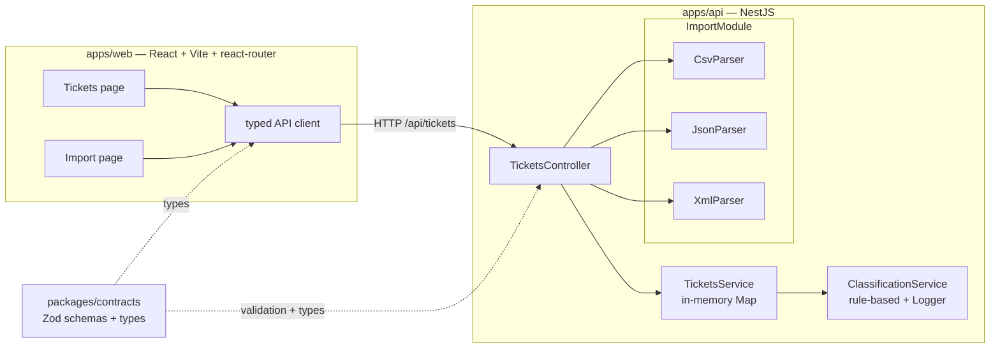
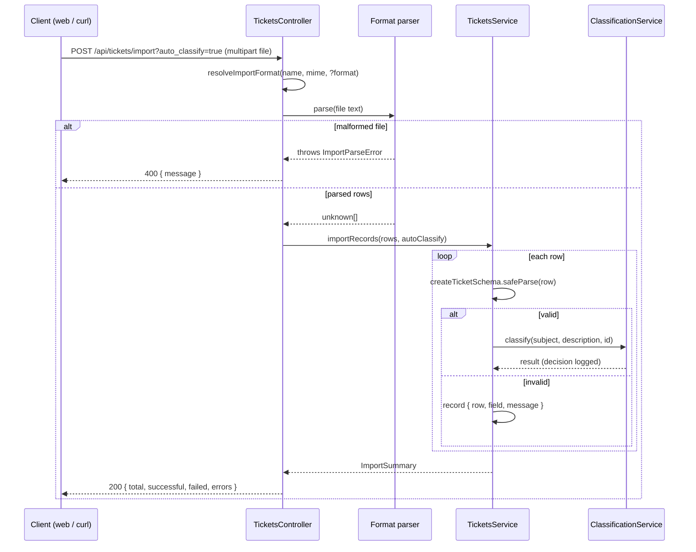
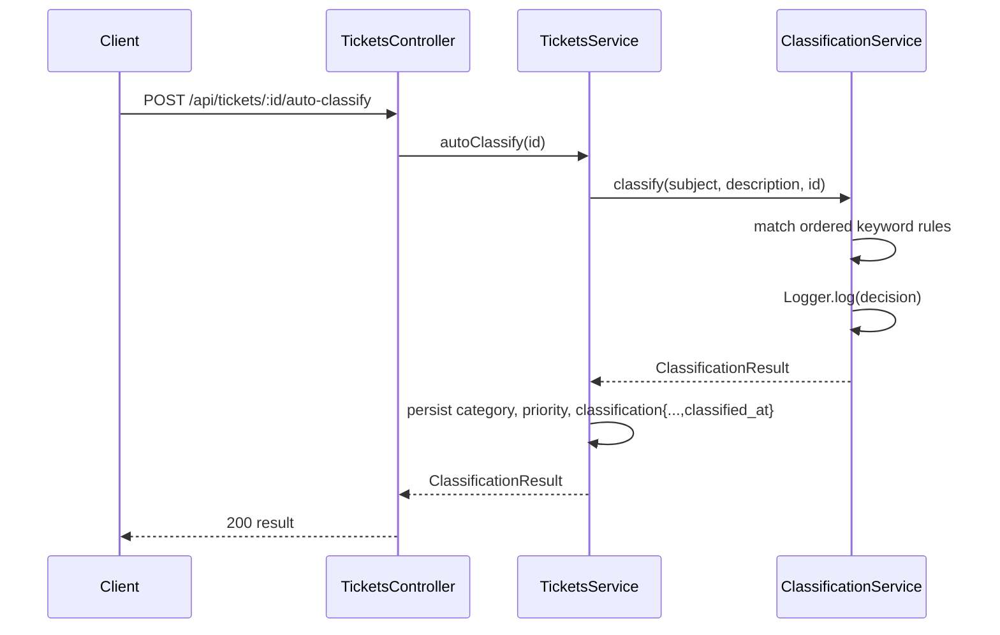
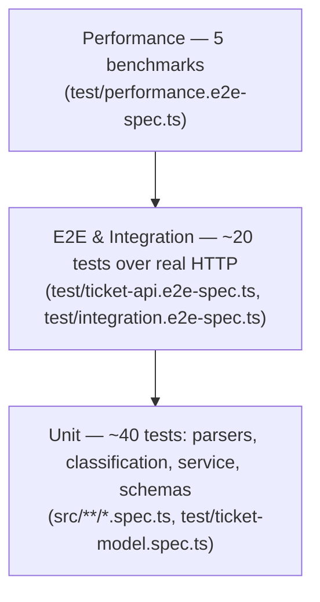

# TASKS.md Completion Implementation Plan

> **For agentic workers:** REQUIRED SUB-SKILL: Use superpowers:subagent-driven-development (recommended) or superpowers:executing-plans to implement this plan task-by-task. Steps use checkbox (`- [ ]`) syntax for tracking.

**Goal:** Complete the homework-2 assignment: multipart CSV/JSON/XML ticket import, persisted + logged auto-classification, 8 required test suites with enforced >85% coverage, react-router web UI, multi-level documentation, and sample-data deliverables.

**Architecture:** A new `ImportModule` in the NestJS API holds three per-format parser services that turn raw file text into `unknown[]` rows; the existing per-row Zod validation loop in `TicketsService` builds the `ImportSummary`. Classification provenance becomes an optional `classification` object on the shared ticket contract. The web app gains react-router with a dedicated import screen.

**Tech Stack:** NestJS 11, Zod 3, papaparse, fast-xml-parser, Jest 29 (two projects: unit + e2e) + supertest, React 19 + Vite 6 + react-router-dom, Turborepo + pnpm workspaces.

**Spec:** `docs/superpowers/specs/2026-07-09-tasks-md-completion-design.md` (approved 2026-07-09).

## Global Constraints

- Run ALL commands from `homework-2/` (the pnpm workspace root), NOT the git repo root. Node ≥ 20, pnpm 10.
- After ANY change under `packages/contracts/src`, run `pnpm --filter @repo/contracts build` before running dependent builds/tests — consumers import `dist/`, not source.
- Relative imports inside `packages/contracts/src` must keep the `.js` suffix (ESM package built by tsup).
- API JSON fields are snake_case; every contracts schema uses `.strict()` (unknown keys rejected).
- New dependencies are limited to: `papaparse`, `fast-xml-parser` (api deps); `@types/papaparse`, `@types/multer` (api devDeps); `react-router-dom` (web dep). Nothing else.
- Import endpoint rules (from spec): multipart field name `file`, 1 MB size limit, format precedence `?format=` param → file extension → MIME type, optional `?auto_classify=true`.
- `pnpm --filter @repo/api lint` lints `src` only; test files are type-checked by ts-jest when tests run — do not add `test/` to the api tsconfig `include` (it would break `nest build`).
- Commit after every task. End each commit message with: `Co-Authored-By: Claude Fable 5 <noreply@anthropic.com>`.
- The API test command is `pnpm --filter @repo/api test`; a single file: `pnpm --filter @repo/api test -- csv-parser`.

---

### Task 1: Jest two-project infrastructure (unit + e2e, merged coverage)

**Files:**
- Create: `apps/api/jest.config.js`
- Modify: `apps/api/package.json` (remove the `"jest"` block)

**Interfaces:**
- Produces: Jest projects `unit` (specs under `src/`) and `e2e` (specs under `test/`, matching both `*.spec.ts` and `*.e2e-spec.ts`); `jest --coverage` merges coverage from both, collected from `src/**/*.ts` except `main.ts`.

- [ ] **Step 1: Create `apps/api/jest.config.js`**

```js
/**
 * Two Jest projects: unit specs colocated in src/, and the e2e/model/
 * integration/performance suites in test/. Coverage is collected once,
 * across both projects, from src/ (main.ts is bootstrap-only).
 */
const shared = {
  moduleFileExtensions: ['js', 'json', 'ts'],
  testEnvironment: 'node',
  transform: { '^.+\\.(t|j)s$': 'ts-jest' },
};

module.exports = {
  projects: [
    {
      ...shared,
      displayName: 'unit',
      rootDir: 'src',
      testRegex: '.*\\.spec\\.ts$',
    },
    {
      ...shared,
      displayName: 'e2e',
      rootDir: '.',
      testRegex: 'test/.*\\.(e2e-)?spec\\.ts$',
    },
  ],
  collectCoverageFrom: ['src/**/*.ts', '!src/main.ts'],
  coverageDirectory: 'coverage',
};
```

- [ ] **Step 2: Remove the `"jest"` block from `apps/api/package.json`**

Delete the entire `"jest": { ... }` object (the last key in the file). Scripts stay unchanged (`"test": "jest"`, `"test:cov": "jest --coverage"`).

- [ ] **Step 3: Run the existing tests to verify the new config picks them up**

Run: `pnpm --filter @repo/api test`
Expected: PASS — 2 suites (`unit` project), 9 tests. The `e2e` project reports "no tests found" but must not fail the run; if Jest exits non-zero because the e2e project has no tests, add `passWithNoTests: true` to the e2e project object (remove it again in Task 2 or leave it — harmless).

- [ ] **Step 4: Commit**

```bash
git add apps/api/jest.config.js apps/api/package.json
git commit -m "test(api): split jest into unit + e2e projects with merged coverage"
```

---

### Task 2: Contracts — classification provenance + ticket-model test suite (test_ticket_model, 9+)

**Files:**
- Modify: `packages/contracts/src/classification.ts`
- Modify: `packages/contracts/src/ticket.ts:22-42` (the `ticketSchema` object)
- Test: `apps/api/test/ticket-model.spec.ts`

**Interfaces:**
- Produces: `ticketClassificationSchema` / type `TicketClassification` = `{ category, priority, confidence, reasoning, keywords_found, classified_at: string (ISO datetime) }`, exported from `@repo/contracts`; `Ticket` gains optional `classification?: TicketClassification`.

- [ ] **Step 1: Write the failing test `apps/api/test/ticket-model.spec.ts`**

```ts
import {
  createTicketSchema,
  ticketClassificationSchema,
  ticketSchema,
  updateTicketSchema,
} from '@repo/contracts';

const validTicket = {
  id: 'e58ed763-928c-4155-bee9-fdbaaadc15f3',
  customer_id: 'cust-1',
  customer_email: 'ada@example.com',
  customer_name: 'Ada Lovelace',
  subject: 'Cannot log in',
  description: 'I forgot my password and cannot access my account at all.',
  category: 'account_access',
  priority: 'high',
  status: 'new',
  created_at: '2026-07-09T10:00:00.000Z',
  updated_at: '2026-07-09T10:00:00.000Z',
  resolved_at: null,
  assigned_to: null,
  tags: ['auth'],
  metadata: { source: 'web_form', device_type: 'desktop' },
};

const validClassification = {
  category: 'account_access',
  priority: 'urgent',
  confidence: 0.8,
  reasoning: 'Matched keywords: password.',
  keywords_found: ['password'],
  classified_at: '2026-07-09T10:00:00.000Z',
};

describe('ticket model contracts', () => {
  it('accepts a fully valid ticket', () => {
    expect(ticketSchema.safeParse(validTicket).success).toBe(true);
  });

  it('rejects an invalid customer email', () => {
    const result = ticketSchema.safeParse({ ...validTicket, customer_email: 'not-an-email' });
    expect(result.success).toBe(false);
  });

  it('rejects a subject longer than 200 characters', () => {
    const result = ticketSchema.safeParse({ ...validTicket, subject: 'x'.repeat(201) });
    expect(result.success).toBe(false);
  });

  it('rejects a description shorter than 10 characters', () => {
    const result = ticketSchema.safeParse({ ...validTicket, description: 'too short' });
    expect(result.success).toBe(false);
  });

  it('rejects an unknown category enum value', () => {
    const result = ticketSchema.safeParse({ ...validTicket, category: 'spam' });
    expect(result.success).toBe(false);
  });

  it('rejects an unknown status enum value', () => {
    const result = ticketSchema.safeParse({ ...validTicket, status: 'archived' });
    expect(result.success).toBe(false);
  });

  it('rejects unknown extra fields (strict mode)', () => {
    const result = ticketSchema.safeParse({ ...validTicket, hacker: true });
    expect(result.success).toBe(false);
  });

  it('accepts a ticket carrying classification provenance', () => {
    const result = ticketSchema.safeParse({ ...validTicket, classification: validClassification });
    expect(result.success).toBe(true);
  });

  it('rejects classification confidence outside [0, 1]', () => {
    const result = ticketClassificationSchema.safeParse({ ...validClassification, confidence: 1.5 });
    expect(result.success).toBe(false);
  });

  it('accepts a minimal create payload (server-owned fields omitted)', () => {
    const result = createTicketSchema.safeParse({
      customer_id: 'cust-1',
      customer_email: 'ada@example.com',
      customer_name: 'Ada Lovelace',
      subject: 'Cannot log in',
      description: 'I forgot my password and cannot access my account at all.',
    });
    expect(result.success).toBe(true);
  });

  it('rejects auto_classify on update payloads (omitted from updateTicketSchema)', () => {
    const result = updateTicketSchema.safeParse({ auto_classify: true });
    expect(result.success).toBe(false);
  });
});
```

- [ ] **Step 2: Run it to verify it fails**

Run: `pnpm --filter @repo/api test -- ticket-model`
Expected: FAIL — `@repo/contracts` has no export named `ticketClassificationSchema` (TS error from ts-jest).

- [ ] **Step 3: Add the schema to `packages/contracts/src/classification.ts`**

Append after the existing `ClassificationResult` export:

```ts
/**
 * Classification provenance persisted on a ticket: what the classifier said, and when.
 * The ticket's own category/priority remain the operative values.
 */
export const ticketClassificationSchema = classificationResultSchema.extend({
  classified_at: z.string().datetime(),
});

export type TicketClassification = z.infer<typeof ticketClassificationSchema>;
```

(`.extend` on a `.strict()` object preserves strictness.)

- [ ] **Step 4: Add the field to `ticketSchema` in `packages/contracts/src/ticket.ts`**

Add the import at the top of the file:

```ts
import { ticketClassificationSchema } from './classification.js';
```

Inside the `ticketSchema` object, after `metadata: ticketMetadataSchema,` add:

```ts
    /** Provenance of the last auto-classification run, if any. */
    classification: ticketClassificationSchema.optional(),
```

- [ ] **Step 5: Rebuild contracts and run the test to verify it passes**

Run: `pnpm --filter @repo/contracts build && pnpm --filter @repo/api test -- ticket-model`
Expected: PASS — 11 tests.

- [ ] **Step 6: Verify nothing else broke**

Run: `pnpm build && pnpm --filter @repo/api test`
Expected: all workspaces build; 20 tests pass.

- [ ] **Step 7: Commit**

```bash
git add packages/contracts/src apps/api/test/ticket-model.spec.ts
git commit -m "feat(contracts): add classification provenance to ticket schema + model test suite"
```

---

### Task 3: Persist classification on tickets and log every decision

**Files:**
- Modify: `apps/api/src/tickets/classification.service.ts` (the `classify` method)
- Modify: `apps/api/src/tickets/tickets.service.ts:23-49` (`create`) and `:100-107` (`autoClassify`)
- Test: `apps/api/src/tickets/tickets.service.spec.ts` (extend)

**Interfaces:**
- Consumes: `TicketClassification` from Task 2.
- Produces: `ClassificationService.classify(subject: string, description: string, ticketId?: string): ClassificationResult` — same return, new optional id used only for logging. `TicketsService.create` stores `classification` when auto-classification ran; `TicketsService.autoClassify(id)` persists `{ ...result, classified_at }` alongside the derived category/priority.

- [ ] **Step 1: Write the failing tests — append to `apps/api/src/tickets/tickets.service.spec.ts` inside the existing `describe`**

```ts
  it('stores classification provenance when auto_classify is requested', () => {
    const ticket = service.create({ ...base, auto_classify: true });
    expect(ticket.classification).toBeDefined();
    expect(ticket.classification?.confidence).toBeGreaterThan(0);
    expect(ticket.classification?.classified_at).toMatch(/^\d{4}-\d{2}-\d{2}T/);
  });

  it('does not store classification when auto_classify is absent', () => {
    const ticket = service.create(base);
    expect(ticket.classification).toBeUndefined();
  });

  it('keeps explicit category on create but still records provenance', () => {
    const ticket = service.create({ ...base, category: 'billing_question', auto_classify: true });
    expect(ticket.category).toBe('billing_question');
    expect(ticket.classification?.category).toBe('account_access');
  });

  it('autoClassify persists provenance and derived fields on the ticket', () => {
    const created = service.create(base);
    const result = service.autoClassify(created.id);
    const reloaded = service.findOne(created.id);
    expect(reloaded.category).toBe(result.category);
    expect(reloaded.priority).toBe(result.priority);
    expect(reloaded.classification?.reasoning).toBe(result.reasoning);
  });
```

And a logging test — add a new top-level `describe` in `apps/api/src/tickets/classification.service.spec.ts`:

```ts
import { Logger } from '@nestjs/common';
```

```ts
describe('ClassificationService logging', () => {
  it('logs every classification decision', () => {
    const logSpy = jest.spyOn(Logger.prototype, 'log').mockImplementation(() => undefined);
    new ClassificationService().classify('Billing issue', 'I was charged twice on my invoice', 'ticket-42');
    expect(logSpy).toHaveBeenCalledWith(expect.stringContaining('ticket-42'));
    expect(logSpy).toHaveBeenCalledWith(expect.stringContaining('billing_question'));
    logSpy.mockRestore();
  });
});
```

- [ ] **Step 2: Run to verify they fail**

Run: `pnpm --filter @repo/api test -- tickets.service && pnpm --filter @repo/api test -- classification.service`
Expected: FAIL — `ticket.classification` is undefined; classify does not accept a third argument / no log emitted.

- [ ] **Step 3: Implement logging in `classification.service.ts`**

Change the import line and add a logger field:

```ts
import { Injectable, Logger } from '@nestjs/common';
```

Inside the class, before `categoryRules`:

```ts
  private readonly logger = new Logger(ClassificationService.name);
```

Replace the `classify` signature and add logging before the return:

```ts
  classify(subject: string, description: string, ticketId?: string): ClassificationResult {
    const haystack = `${subject}\n${description}`.toLowerCase();
    const matched: string[] = [];

    const category = this.matchCategory(haystack, matched);
    const priority = this.matchPriority(haystack, matched);

    // Confidence scales with how many distinct keywords matched (capped at 0.95).
    const confidence = matched.length === 0 ? 0.3 : Math.min(0.95, 0.5 + matched.length * 0.15);

    const reasoning =
      matched.length === 0
        ? 'No strong signals found; defaulted to "other" / "medium".'
        : `Matched keywords: ${matched.join(', ')}.`;

    const result: ClassificationResult = {
      category,
      priority,
      confidence: Number(confidence.toFixed(2)),
      reasoning,
      keywords_found: matched,
    };

    this.logger.log(
      `Classified ${ticketId ?? '(new ticket)'} → category=${result.category}, ` +
        `priority=${result.priority}, confidence=${result.confidence}, ` +
        `keywords=[${matched.join(', ')}]`,
    );

    return result;
  }
```

- [ ] **Step 4: Implement persistence in `tickets.service.ts`**

Replace the `create` method (generate the id first so it reaches the log):

```ts
  create(input: CreateTicketInput): Ticket {
    const now = new Date().toISOString();
    const id = randomUUID();
    const auto = input.auto_classify
      ? this.classifier.classify(input.subject, input.description, id)
      : undefined;

    const ticket: Ticket = {
      id,
      customer_id: input.customer_id,
      customer_email: input.customer_email,
      customer_name: input.customer_name,
      subject: input.subject,
      description: input.description,
      category: input.category ?? auto?.category ?? 'other',
      priority: input.priority ?? auto?.priority ?? 'medium',
      status: input.status ?? 'new',
      created_at: now,
      updated_at: now,
      resolved_at: null,
      assigned_to: input.assigned_to ?? null,
      tags: input.tags ?? [],
      metadata: input.metadata ?? {},
      ...(auto ? { classification: { ...auto, classified_at: now } } : {}),
    };

    this.tickets.set(ticket.id, ticket);
    return ticket;
  }
```

Replace the `autoClassify` method (it can no longer go through `update()` because `classification` is not part of `UpdateTicketInput`):

```ts
  /** Auto-classify an existing ticket and persist the derived fields + provenance. */
  autoClassify(id: string) {
    const ticket = this.findOne(id);
    const result = this.classifier.classify(ticket.subject, ticket.description, id);
    const now = new Date().toISOString();
    this.tickets.set(id, {
      ...ticket,
      category: result.category,
      priority: result.priority,
      classification: { ...result, classified_at: now },
      updated_at: now,
    });
    return result;
  }
```

- [ ] **Step 5: Run tests to verify they pass**

Run: `pnpm --filter @repo/api test`
Expected: PASS — all suites (25 tests).

- [ ] **Step 6: Commit**

```bash
git add apps/api/src/tickets
git commit -m "feat(api): persist classification provenance and log every decision"
```

---

### Task 4: Categorization suite to 10+ tests (test_categorization)

**Files:**
- Test: `apps/api/src/tickets/classification.service.spec.ts` (extend the first `describe`)

**Interfaces:**
- Consumes: `ClassificationService.classify(subject, description, ticketId?)` from Task 3.

- [ ] **Step 1: Add the missing category/priority/confidence cases to the existing `describe('ClassificationService')` block**

```ts
  it('classifies payment problems as billing_question', () => {
    const result = service.classify('Refund please', 'I need a refund for the duplicate charge on my invoice');
    expect(result.category).toBe('billing_question');
  });

  it('classifies reproducible defects as bug_report', () => {
    const result = service.classify('Broken export', 'Found a bug — steps to reproduce: click export twice');
    expect(result.category).toBe('bug_report');
  });

  it('classifies crashes as technical_issue', () => {
    const result = service.classify('App crash', 'The dashboard throws an exception and crashes on load');
    expect(result.category).toBe('technical_issue');
  });

  it('classifies enhancement ideas as feature_request', () => {
    const result = service.classify('Idea', 'It would be nice to have a dark mode, please add it');
    expect(result.category).toBe('feature_request');
  });

  it('assigns high priority to blocking issues', () => {
    const result = service.classify('Blocked', 'This error is blocking our release, please fix asap');
    expect(result.priority).toBe('high');
  });

  it('assigns low priority to cosmetic issues', () => {
    const result = service.classify('Minor issue', 'A minor cosmetic misalignment on the settings page button');
    expect(result.priority).toBe('low');
  });

  it('matching is case-insensitive', () => {
    const result = service.classify('PASSWORD RESET', 'CANNOT LOG IN TO MY ACCOUNT ANYMORE');
    expect(result.category).toBe('account_access');
  });

  it('confidence grows with keyword count and never exceeds 0.95', () => {
    const one = service.classify('bug', 'This is definitely a bug somewhere in the code');
    const many = service.classify(
      'critical security bug',
      "Can't access production down critical security bug defect reproduce error crash important blocking",
    );
    expect(many.confidence).toBeGreaterThan(one.confidence);
    expect(many.confidence).toBeLessThanOrEqual(0.95);
  });

  it('returns the exact keywords that fired', () => {
    const result = service.classify('Invoice payment', 'The payment on my invoice failed');
    expect(result.keywords_found).toEqual(expect.arrayContaining(['payment', 'invoice']));
  });
```

- [ ] **Step 2: Run to verify all pass**

Run: `pnpm --filter @repo/api test -- classification.service`
Expected: PASS — 13 tests (12 categorization + 1 logging). If any assertion disagrees with the rule tables in `classification.service.ts`, fix the TEST (the rules are spec-approved as-is; e.g. remember category rules are checked in order: account_access → billing_question → bug_report → technical_issue → feature_request).

- [ ] **Step 3: Commit**

```bash
git add apps/api/src/tickets/classification.service.spec.ts
git commit -m "test(api): extend categorization suite to cover all categories and priorities"
```

---

### Task 5: CSV parser service (test_import_csv, 6+)

**Files:**
- Create: `apps/api/src/import/import-parse.error.ts`
- Create: `apps/api/src/import/csv-parser.service.ts`
- Test: `apps/api/src/import/csv-parser.spec.ts`

**Interfaces:**
- Produces: `class ImportParseError extends Error` — thrown by ALL parsers for file-level problems (Tasks 6–8 reuse it). `CsvParserService.parse(content: string): unknown[]` — rows shaped like `CreateTicketInput` candidates; row-level *content* validity is NOT this class's job (Zod handles it later). CSV conventions: header row required; `tags` column pipe-separated; `metadata_source` / `metadata_browser` / `metadata_device_type` columns → nested `metadata`; empty cells omitted.

- [ ] **Step 1: Install dependencies**

Run: `pnpm --filter @repo/api add papaparse && pnpm --filter @repo/api add -D @types/papaparse @types/multer`
(`@types/multer` is used by Task 8; installing here avoids a second lockfile churn.)

- [ ] **Step 2: Write the failing test `apps/api/src/import/csv-parser.spec.ts`**

```ts
import { CsvParserService } from './csv-parser.service';
import { ImportParseError } from './import-parse.error';

const HEADER =
  'customer_id,customer_email,customer_name,subject,description,tags,metadata_source,metadata_device_type';

describe('CsvParserService', () => {
  const parser = new CsvParserService();

  it('parses a valid CSV with a header row into records', () => {
    const csv = `${HEADER}\ncust-1,ada@example.com,Ada,Login broken,I cannot access my account at all.,,web_form,desktop`;
    const rows = parser.parse(csv);
    expect(rows).toHaveLength(1);
    expect(rows[0]).toMatchObject({ customer_id: 'cust-1', subject: 'Login broken' });
  });

  it('supports quoted fields containing commas', () => {
    const csv = `${HEADER}\ncust-1,ada@example.com,Ada,"Login, 2FA broken","I cannot log in, reset, or use 2FA.",,web_form,desktop`;
    const rows = parser.parse(csv) as Array<Record<string, unknown>>;
    expect(rows[0].subject).toBe('Login, 2FA broken');
  });

  it('splits pipe-separated tags into an array', () => {
    const csv = `${HEADER}\ncust-1,ada@example.com,Ada,Slow app,The dashboard is very slow today.,perf|ui,web_form,desktop`;
    const rows = parser.parse(csv) as Array<Record<string, unknown>>;
    expect(rows[0].tags).toEqual(['perf', 'ui']);
  });

  it('nests metadata_* columns under metadata', () => {
    const csv = `${HEADER}\ncust-1,ada@example.com,Ada,Slow app,The dashboard is very slow today.,,email,mobile`;
    const rows = parser.parse(csv) as Array<Record<string, unknown>>;
    expect(rows[0].metadata).toEqual({ source: 'email', device_type: 'mobile' });
  });

  it('omits empty cells so optional fields stay undefined', () => {
    const csv = `${HEADER}\ncust-1,ada@example.com,Ada,Slow app,The dashboard is very slow today.,,,`;
    const rows = parser.parse(csv) as Array<Record<string, unknown>>;
    expect(rows[0]).not.toHaveProperty('tags');
    expect(rows[0]).not.toHaveProperty('metadata');
  });

  it('throws ImportParseError on an empty file', () => {
    expect(() => parser.parse('   ')).toThrow(ImportParseError);
  });

  it('throws ImportParseError on structurally malformed CSV (unclosed quote)', () => {
    const csv = `${HEADER}\n"cust-1,ada@example.com,Ada,Broken,Unclosed quote row`;
    expect(() => parser.parse(csv)).toThrow(ImportParseError);
  });

  it('throws ImportParseError when the header row is missing required columns', () => {
    expect(() => parser.parse('foo,bar\n1,2')).toThrow(ImportParseError);
  });
});
```

- [ ] **Step 3: Run to verify it fails**

Run: `pnpm --filter @repo/api test -- csv-parser`
Expected: FAIL — cannot find module `./csv-parser.service`.

- [ ] **Step 4: Create `apps/api/src/import/import-parse.error.ts`**

```ts
/**
 * File-level parse failure (malformed/empty/unrecognized file). Mapped to
 * HTTP 400 by the controller. Row-level content problems are NOT parse
 * errors — they land in the ImportSummary via Zod validation.
 */
export class ImportParseError extends Error {
  constructor(message: string) {
    super(message);
    this.name = 'ImportParseError';
  }
}
```

- [ ] **Step 5: Create `apps/api/src/import/csv-parser.service.ts`**

```ts
import { Injectable } from '@nestjs/common';
import Papa from 'papaparse';
import { ImportParseError } from './import-parse.error';

const METADATA_PREFIX = 'metadata_';

/**
 * CSV → ticket-record candidates. Conventions: header row required;
 * `tags` is pipe-separated; `metadata_*` columns nest under `metadata`;
 * empty cells are omitted so Zod optionality applies downstream.
 */
@Injectable()
export class CsvParserService {
  parse(content: string): unknown[] {
    if (!content.trim()) throw new ImportParseError('CSV file is empty');

    const parsed = Papa.parse<Record<string, string>>(content.trim(), {
      header: true,
      skipEmptyLines: true,
    });

    if (parsed.errors.length > 0) {
      const first = parsed.errors[0];
      throw new ImportParseError(
        `Malformed CSV at row ${first.row ?? 'unknown'}: ${first.message}`,
      );
    }
    if (!parsed.meta.fields?.includes('customer_id')) {
      throw new ImportParseError(
        'CSV header row is missing required columns (expected customer_id, customer_email, …)',
      );
    }

    return parsed.data.map((row) => this.toRecord(row));
  }

  private toRecord(row: Record<string, string>): unknown {
    const record: Record<string, unknown> = {};
    const metadata: Record<string, string> = {};

    for (const [key, raw] of Object.entries(row)) {
      const value = raw?.trim();
      if (!value) continue;
      if (key === 'tags') {
        record.tags = value
          .split('|')
          .map((tag) => tag.trim())
          .filter(Boolean);
      } else if (key.startsWith(METADATA_PREFIX)) {
        metadata[key.slice(METADATA_PREFIX.length)] = value;
      } else {
        record[key] = value;
      }
    }

    if (Object.keys(metadata).length > 0) record.metadata = metadata;
    return record;
  }
}
```

- [ ] **Step 6: Run to verify it passes**

Run: `pnpm --filter @repo/api test -- csv-parser`
Expected: PASS — 8 tests.

- [ ] **Step 7: Commit**

```bash
git add apps/api/src/import apps/api/package.json pnpm-lock.yaml
git commit -m "feat(api): CSV import parser with tags/metadata mapping"
```

---

### Task 6: JSON parser service (test_import_json, 5+)

**Files:**
- Create: `apps/api/src/import/json-parser.service.ts`
- Test: `apps/api/src/import/json-parser.spec.ts`

**Interfaces:**
- Consumes: `ImportParseError` from Task 5.
- Produces: `JsonParserService.parse(content: string): unknown[]` — accepts a bare JSON array or a `{ "records": [...] }` envelope.

- [ ] **Step 1: Write the failing test `apps/api/src/import/json-parser.spec.ts`**

```ts
import { ImportParseError } from './import-parse.error';
import { JsonParserService } from './json-parser.service';

describe('JsonParserService', () => {
  const parser = new JsonParserService();

  it('parses a bare array of records', () => {
    expect(parser.parse('[{"customer_id":"c1"},{"customer_id":"c2"}]')).toHaveLength(2);
  });

  it('parses a { records: [...] } envelope', () => {
    expect(parser.parse('{"records":[{"customer_id":"c1"}]}')).toHaveLength(1);
  });

  it('throws ImportParseError on malformed JSON', () => {
    expect(() => parser.parse('{"records": [oops')).toThrow(ImportParseError);
  });

  it('throws ImportParseError when JSON is neither array nor envelope', () => {
    expect(() => parser.parse('{"tickets": 5}')).toThrow(ImportParseError);
  });

  it('throws ImportParseError on an empty file', () => {
    expect(() => parser.parse('')).toThrow(ImportParseError);
  });
});
```

- [ ] **Step 2: Run to verify it fails**

Run: `pnpm --filter @repo/api test -- json-parser`
Expected: FAIL — cannot find module `./json-parser.service`.

- [ ] **Step 3: Create `apps/api/src/import/json-parser.service.ts`**

```ts
import { Injectable } from '@nestjs/common';
import { ImportParseError } from './import-parse.error';

/** JSON → ticket-record candidates: a bare array, or a { records: [...] } envelope. */
@Injectable()
export class JsonParserService {
  parse(content: string): unknown[] {
    if (!content.trim()) throw new ImportParseError('JSON file is empty');

    let data: unknown;
    try {
      data = JSON.parse(content);
    } catch (error) {
      throw new ImportParseError(`Malformed JSON: ${(error as Error).message}`);
    }

    if (Array.isArray(data)) return data;
    if (data && typeof data === 'object' && Array.isArray((data as { records?: unknown }).records)) {
      return (data as { records: unknown[] }).records;
    }
    throw new ImportParseError(
      'JSON must be an array of tickets or an object with a "records" array',
    );
  }
}
```

- [ ] **Step 4: Run to verify it passes**

Run: `pnpm --filter @repo/api test -- json-parser`
Expected: PASS — 5 tests.

- [ ] **Step 5: Commit**

```bash
git add apps/api/src/import
git commit -m "feat(api): JSON import parser (bare array or records envelope)"
```

---

### Task 7: XML parser service (test_import_xml, 5+)

**Files:**
- Create: `apps/api/src/import/xml-parser.service.ts`
- Test: `apps/api/src/import/xml-parser.spec.ts`

**Interfaces:**
- Consumes: `ImportParseError` from Task 5.
- Produces: `XmlParserService.parse(content: string): unknown[]` — expects `<tickets><ticket>…</ticket></tickets>`; `<tags><tag>x</tag></tags>` → `tags: string[]`; nested `<metadata>` → object; a single `<ticket>` is normalized to a one-element array. All leaf values stay strings.

- [ ] **Step 1: Install the dependency**

Run: `pnpm --filter @repo/api add fast-xml-parser`

- [ ] **Step 2: Write the failing test `apps/api/src/import/xml-parser.spec.ts`**

```ts
import { ImportParseError } from './import-parse.error';
import { XmlParserService } from './xml-parser.service';

const wrap = (inner: string) => `<?xml version="1.0" encoding="UTF-8"?><tickets>${inner}</tickets>`;

const TICKET = `<ticket>
  <customer_id>cust-1</customer_id>
  <customer_email>ada@example.com</customer_email>
  <customer_name>Ada Lovelace</customer_name>
  <subject>Cannot log in</subject>
  <description>I forgot my password and cannot access my account.</description>
  <tags><tag>auth</tag><tag>login</tag></tags>
  <metadata><source>email</source><device_type>mobile</device_type></metadata>
</ticket>`;

describe('XmlParserService', () => {
  const parser = new XmlParserService();

  it('parses multiple tickets', () => {
    expect(parser.parse(wrap(TICKET + TICKET))).toHaveLength(2);
  });

  it('normalizes a single ticket to a one-element array', () => {
    const rows = parser.parse(wrap(TICKET)) as Array<Record<string, unknown>>;
    expect(rows).toHaveLength(1);
    expect(rows[0].customer_id).toBe('cust-1');
  });

  it('maps nested tags and metadata elements', () => {
    const rows = parser.parse(wrap(TICKET)) as Array<Record<string, unknown>>;
    expect(rows[0].tags).toEqual(['auth', 'login']);
    expect(rows[0].metadata).toEqual({ source: 'email', device_type: 'mobile' });
  });

  it('normalizes a single <tag> child to a one-element array', () => {
    const single = TICKET.replace('<tags><tag>auth</tag><tag>login</tag></tags>', '<tags><tag>solo</tag></tags>');
    const rows = parser.parse(wrap(single)) as Array<Record<string, unknown>>;
    expect(rows[0].tags).toEqual(['solo']);
  });

  it('throws ImportParseError on malformed XML', () => {
    expect(() => parser.parse('<tickets><ticket><subject>Unclosed')).toThrow(ImportParseError);
  });

  it('throws ImportParseError when the tickets root is missing', () => {
    expect(() => parser.parse('<items><item>x</item></items>')).toThrow(ImportParseError);
  });

  it('throws ImportParseError on an empty file', () => {
    expect(() => parser.parse('')).toThrow(ImportParseError);
  });
});
```

- [ ] **Step 3: Run to verify it fails**

Run: `pnpm --filter @repo/api test -- xml-parser`
Expected: FAIL — cannot find module `./xml-parser.service`.

- [ ] **Step 4: Create `apps/api/src/import/xml-parser.service.ts`**

```ts
import { Injectable } from '@nestjs/common';
import { XMLParser, XMLValidator } from 'fast-xml-parser';
import { ImportParseError } from './import-parse.error';

/**
 * XML → ticket-record candidates. Expected shape:
 * <tickets><ticket>…<tags><tag>x</tag></tags><metadata>…</metadata></ticket></tickets>
 * parseTagValue is off so ids like "42" survive as strings for Zod.
 */
@Injectable()
export class XmlParserService {
  private readonly parser = new XMLParser({
    ignoreAttributes: true,
    parseTagValue: false,
    trimValues: true,
  });

  parse(content: string): unknown[] {
    if (!content.trim()) throw new ImportParseError('XML file is empty');

    const validation = XMLValidator.validate(content);
    if (validation !== true) {
      throw new ImportParseError(
        `Malformed XML: ${validation.err.msg} (line ${validation.err.line})`,
      );
    }

    const doc = this.parser.parse(content) as { tickets?: { ticket?: unknown } };
    const raw = doc.tickets?.ticket;
    if (raw === undefined) {
      throw new ImportParseError('XML must contain <tickets><ticket>…</ticket></tickets>');
    }

    const list = Array.isArray(raw) ? raw : [raw];
    return list.map((node) => this.toRecord(node as Record<string, unknown>));
  }

  private toRecord(node: Record<string, unknown>): unknown {
    const record: Record<string, unknown> = { ...node };
    if ('tags' in record) {
      const tag = (record.tags as { tag?: unknown } | null | undefined)?.tag;
      if (tag === undefined) delete record.tags; // empty <tags/> element
      else record.tags = Array.isArray(tag) ? tag : [tag];
    }
    return record;
  }
}
```

- [ ] **Step 5: Run to verify it passes**

Run: `pnpm --filter @repo/api test -- xml-parser`
Expected: PASS — 7 tests.

- [ ] **Step 6: Commit**

```bash
git add apps/api/src/import apps/api/package.json pnpm-lock.yaml
git commit -m "feat(api): XML import parser with tags/metadata normalization"
```

---

### Task 8: Multipart import endpoint + format resolution + `importRecords`

**Files:**
- Create: `apps/api/src/import/import-format.ts`
- Create: `apps/api/src/import/import.module.ts`
- Modify: `apps/api/src/tickets/tickets.module.ts`
- Modify: `apps/api/src/tickets/tickets.controller.ts` (constructor + the `import` handler)
- Modify: `apps/api/src/tickets/tickets.service.ts:109-134` (`importJson` → `importRecords`)
- Test: `apps/api/src/import/import-format.spec.ts`, `apps/api/src/tickets/tickets.service.spec.ts` (adjust)

**Interfaces:**
- Consumes: the three parser services (Tasks 5–7), `ImportParseError`.
- Produces: `resolveImportFormat(filename: string, mimetype: string, override?: string): ImportFormat | undefined`; `TicketsService.importRecords(rows: unknown[], autoClassify?: boolean): ImportSummary` (replaces `importJson`); `POST /tickets/import` accepting multipart `file` with `?format=` and `?auto_classify=` query params. Tasks 10–12, 15 rely on this endpoint shape.

- [ ] **Step 1: Write the failing test `apps/api/src/import/import-format.spec.ts`**

```ts
import { resolveImportFormat } from './import-format';

describe('resolveImportFormat', () => {
  it('honors a valid explicit override above everything', () => {
    expect(resolveImportFormat('data.json', 'application/json', 'xml')).toBe('xml');
  });

  it('returns undefined for an invalid override instead of falling through', () => {
    expect(resolveImportFormat('data.csv', 'text/csv', 'yaml')).toBeUndefined();
  });

  it('resolves by file extension', () => {
    expect(resolveImportFormat('tickets.CSV', 'application/octet-stream')).toBe('csv');
    expect(resolveImportFormat('tickets.xml', 'application/octet-stream')).toBe('xml');
  });

  it('falls back to MIME type when the extension is unknown', () => {
    expect(resolveImportFormat('upload.tmp', 'application/json')).toBe('json');
    expect(resolveImportFormat('upload.tmp', 'text/xml')).toBe('xml');
  });

  it('returns undefined when nothing matches', () => {
    expect(resolveImportFormat('upload.tmp', 'application/pdf')).toBeUndefined();
  });
});
```

Also update `tickets.service.spec.ts`: rename the `importJson` test and add an auto-classify case — replace the existing `'summarizes a JSON import with row-level errors'` test with:

```ts
  it('summarizes an import with row-level errors', () => {
    const summary = service.importRecords([base, { customer_id: 'x' }]);
    expect(summary.total).toBe(2);
    expect(summary.successful).toBe(1);
    expect(summary.failed).toBe(1);
    expect(summary.errors[0].row).toBe(1);
  });

  it('classifies every imported row when autoClassify is set', () => {
    service.importRecords([base], true);
    const [ticket] = service.findAll();
    expect(ticket.classification).toBeDefined();
    expect(ticket.category).toBe('account_access');
  });
```

- [ ] **Step 2: Run to verify failures**

Run: `pnpm --filter @repo/api test -- import-format && pnpm --filter @repo/api test -- tickets.service`
Expected: FAIL — module `./import-format` not found; `service.importRecords is not a function`.

- [ ] **Step 3: Create `apps/api/src/import/import-format.ts`**

```ts
import { importFormatSchema, type ImportFormat } from '@repo/contracts';

const EXTENSION_TO_FORMAT: Record<string, ImportFormat> = {
  csv: 'csv',
  json: 'json',
  xml: 'xml',
};

const MIME_TO_FORMAT: Record<string, ImportFormat> = {
  'text/csv': 'csv',
  'application/json': 'json',
  'application/xml': 'xml',
  'text/xml': 'xml',
};

/**
 * Precedence (spec): explicit ?format= override → file extension → MIME type.
 * An invalid override is a caller mistake and resolves to undefined (→ 400),
 * never silently falls through to guessing.
 */
export function resolveImportFormat(
  filename: string,
  mimetype: string,
  override?: string,
): ImportFormat | undefined {
  if (override !== undefined) {
    const parsed = importFormatSchema.safeParse(override);
    return parsed.success ? parsed.data : undefined;
  }
  const extension = filename.split('.').pop()?.toLowerCase() ?? '';
  return EXTENSION_TO_FORMAT[extension] ?? MIME_TO_FORMAT[mimetype];
}
```

- [ ] **Step 4: Create `apps/api/src/import/import.module.ts`**

```ts
import { Module } from '@nestjs/common';
import { CsvParserService } from './csv-parser.service';
import { JsonParserService } from './json-parser.service';
import { XmlParserService } from './xml-parser.service';

@Module({
  providers: [CsvParserService, JsonParserService, XmlParserService],
  exports: [CsvParserService, JsonParserService, XmlParserService],
})
export class ImportModule {}
```

- [ ] **Step 5: Wire it into `apps/api/src/tickets/tickets.module.ts`**

```ts
import { Module } from '@nestjs/common';
import { ImportModule } from '../import/import.module';
import { ClassificationService } from './classification.service';
import { TicketsController } from './tickets.controller';
import { TicketsService } from './tickets.service';

@Module({
  imports: [ImportModule],
  controllers: [TicketsController],
  providers: [TicketsService, ClassificationService],
  exports: [TicketsService, ClassificationService],
})
export class TicketsModule {}
```

- [ ] **Step 6: Rename `importJson` → `importRecords` in `tickets.service.ts`**

Replace the whole method:

```ts
  /** Bulk import parsed rows, returning a per-row summary. */
  importRecords(rows: unknown[], autoClassify = false): ImportSummary {
    const summary: ImportSummary = {
      total: rows.length,
      successful: 0,
      failed: 0,
      errors: [],
    };

    rows.forEach((row, index) => {
      const parsed = createTicketSchema.safeParse(row);
      if (parsed.success) {
        this.create({ ...parsed.data, auto_classify: autoClassify || parsed.data.auto_classify });
        summary.successful += 1;
      } else {
        summary.failed += 1;
        const firstIssue = parsed.error.errors[0];
        summary.errors.push({
          row: index,
          field: firstIssue?.path.join('.'),
          message: firstIssue?.message ?? 'Invalid record',
        });
      }
    });

    return summary;
  }
```

- [ ] **Step 7: Replace the `import` handler in `tickets.controller.ts`**

New/changed imports at the top of the file:

```ts
import {
  BadRequestException,
  Body,
  Controller,
  Delete,
  Get,
  HttpCode,
  Param,
  Post,
  Put,
  Query,
  UploadedFile,
  UseInterceptors,
} from '@nestjs/common';
import { FileInterceptor } from '@nestjs/platform-express';
import { CsvParserService } from '../import/csv-parser.service';
import { ImportParseError } from '../import/import-parse.error';
import { resolveImportFormat } from '../import/import-format';
import { JsonParserService } from '../import/json-parser.service';
import { XmlParserService } from '../import/xml-parser.service';
```

(keep the existing `@repo/contracts` and pipe imports; add `type ImportFormat` to the contracts import)

Constructor:

```ts
  constructor(
    private readonly tickets: TicketsService,
    private readonly csvParser: CsvParserService,
    private readonly jsonParser: JsonParserService,
    private readonly xmlParser: XmlParserService,
  ) {}
```

Replace the `import` method:

```ts
  @Post('import')
  @HttpCode(200)
  @UseInterceptors(FileInterceptor('file', { limits: { fileSize: 1024 * 1024 } }))
  import(
    @UploadedFile() file: Express.Multer.File | undefined,
    @Query('format') format?: string,
    @Query('auto_classify') autoClassify?: string,
  ): ImportSummary {
    if (!file || file.size === 0) {
      throw new BadRequestException('Upload a non-empty file in the "file" form field');
    }

    const resolved = resolveImportFormat(file.originalname, file.mimetype, format);
    if (!resolved) {
      throw new BadRequestException(
        'Cannot determine the file format — pass ?format=csv|json|xml or use a .csv/.json/.xml file',
      );
    }

    const parsers: Record<ImportFormat, { parse(content: string): unknown[] }> = {
      csv: this.csvParser,
      json: this.jsonParser,
      xml: this.xmlParser,
    };

    try {
      const rows = parsers[resolved].parse(file.buffer.toString('utf8'));
      return this.tickets.importRecords(rows, autoClassify === 'true');
    } catch (error) {
      if (error instanceof ImportParseError) throw new BadRequestException(error.message);
      throw error;
    }
  }
```

- [ ] **Step 8: Run tests + type-check to verify everything passes**

Run: `pnpm --filter @repo/api type-check && pnpm --filter @repo/api test`
Expected: type-check clean; every suite passes (unit + e2e projects, 60+ tests at this point). If `Express.Multer.File` is not found, confirm `@types/multer` is in `apps/api/package.json` devDependencies (installed in Task 5).

- [ ] **Step 9: Smoke-test the endpoint manually**

Run (two terminals or background the first):

```bash
pnpm --filter @repo/api build && node apps/api/dist/main.js &
sleep 2
printf 'customer_id,customer_email,customer_name,subject,description\ncust-1,ada@example.com,Ada,Login broken,I cannot access my account at all.\n' > /tmp/smoke.csv
curl -s -X POST 'http://localhost:3001/api/tickets/import?auto_classify=true' -F 'file=@/tmp/smoke.csv'
kill %1
```

Expected output: `{"total":1,"successful":1,"failed":0,"errors":[]}`

- [ ] **Step 10: Commit**

```bash
git add apps/api/src
git commit -m "feat(api): multipart /tickets/import with CSV/JSON/XML format resolution"
```

---

### Task 9: Sample-data fixtures (Deliverable 3)

**Files:**
- Create: `apps/api/scripts/generate-fixtures.mjs`
- Create (generated): `apps/api/test/fixtures/sample_tickets.csv` (50), `sample_tickets.json` (20), `sample_tickets.xml` (30), `invalid/malformed.csv`, `invalid/invalid-rows.json`, `invalid/broken.xml`, `invalid/empty.csv`

**Interfaces:**
- Produces: fixture files consumed by Tasks 10–12 via `fs.readFileSync(path.join(__dirname, 'fixtures', …))`. `invalid-rows.json` is VALID JSON whose 3 records are: bad email, missing required fields, fully valid → import summary `{total: 3, successful: 1, failed: 2}`. Subjects/descriptions cycle through classifier keywords so bulk imports spread across categories (seed index 5 of every cycle is a "production down"/critical → urgent ticket).

- [ ] **Step 1: Create `apps/api/scripts/generate-fixtures.mjs`**

```js
/**
 * Deterministic sample-data generator (Deliverable 3). Regenerate with:
 *   node apps/api/scripts/generate-fixtures.mjs
 * Subjects/descriptions cycle through classifier keywords so bulk imports
 * exercise every category and priority.
 */
import { mkdirSync, writeFileSync } from 'node:fs';
import { dirname, join } from 'node:path';
import { fileURLToPath } from 'node:url';

const here = dirname(fileURLToPath(import.meta.url));
const fixturesDir = join(here, '..', 'test', 'fixtures');
const invalidDir = join(fixturesDir, 'invalid');
mkdirSync(invalidDir, { recursive: true });

const SEEDS = [
  { subject: 'Cannot reset my password', description: 'I forgot my password and now I am locked out of my account.', tags: ['auth'] },
  { subject: 'Payment failed twice', description: 'My invoice shows a duplicate charge on my subscription, need a refund.', tags: ['billing', 'money'] },
  { subject: 'App crash on startup', description: 'The application throws an error and crashes every time I open it.', tags: [] },
  { subject: 'Found a bug in export', description: 'Steps to reproduce: open the report, click export, the file is corrupted.', tags: ['export'] },
  { subject: 'Please add dark mode', description: 'It would be nice to have a dark mode feature, just a suggestion.', tags: ['ui'] },
  { subject: 'Production down for all users', description: 'Critical outage, production down since 09:00, this is blocking everyone.', tags: ['outage', 'critical'] },
  { subject: 'Question about my plan', description: 'I would like to understand what my current plan includes exactly.', tags: [] },
];
const SOURCES = ['web_form', 'email', 'api', 'chat', 'phone'];
const DEVICES = ['desktop', 'mobile', 'tablet'];

function ticket(i) {
  const seed = SEEDS[i % SEEDS.length];
  return {
    customer_id: `cust-${String(i + 1).padStart(3, '0')}`,
    customer_email: `customer${i + 1}@example.com`,
    customer_name: `Customer ${i + 1}`,
    subject: `${seed.subject} (#${i + 1})`,
    description: seed.description,
    tags: seed.tags,
    metadata: { source: SOURCES[i % SOURCES.length], device_type: DEVICES[i % DEVICES.length] },
  };
}

// --- sample_tickets.csv (50 records) ---
const csvHeader =
  'customer_id,customer_email,customer_name,subject,description,tags,metadata_source,metadata_device_type';
const csvEscape = (v) => (/[",\n]/.test(v) ? `"${v.replaceAll('"', '""')}"` : v);
const csvRows = Array.from({ length: 50 }, (_, i) => {
  const t = ticket(i);
  return [
    t.customer_id, t.customer_email, t.customer_name, t.subject, t.description,
    t.tags.join('|'), t.metadata.source, t.metadata.device_type,
  ].map(csvEscape).join(',');
});
writeFileSync(join(fixturesDir, 'sample_tickets.csv'), [csvHeader, ...csvRows].join('\n') + '\n');

// --- sample_tickets.json (20 records) ---
writeFileSync(
  join(fixturesDir, 'sample_tickets.json'),
  JSON.stringify({ records: Array.from({ length: 20 }, (_, i) => ticket(i)) }, null, 2) + '\n',
);

// --- sample_tickets.xml (30 records) ---
const xmlEscape = (v) => v.replaceAll('&', '&amp;').replaceAll('<', '&lt;').replaceAll('>', '&gt;');
const xmlTickets = Array.from({ length: 30 }, (_, i) => {
  const t = ticket(i);
  const tags = t.tags.map((tag) => `<tag>${xmlEscape(tag)}</tag>`).join('');
  return `  <ticket>
    <customer_id>${t.customer_id}</customer_id>
    <customer_email>${t.customer_email}</customer_email>
    <customer_name>${xmlEscape(t.customer_name)}</customer_name>
    <subject>${xmlEscape(t.subject)}</subject>
    <description>${xmlEscape(t.description)}</description>
    <tags>${tags}</tags>
    <metadata><source>${t.metadata.source}</source><device_type>${t.metadata.device_type}</device_type></metadata>
  </ticket>`;
});
writeFileSync(
  join(fixturesDir, 'sample_tickets.xml'),
  `<?xml version="1.0" encoding="UTF-8"?>\n<tickets>\n${xmlTickets.join('\n')}\n</tickets>\n`,
);

// --- invalid files for negative tests ---
writeFileSync(join(invalidDir, 'malformed.csv'),
  'customer_id,customer_email,subject\n"unclosed quote,bad@example.com,Broken row\n');
writeFileSync(join(invalidDir, 'invalid-rows.json'),
  JSON.stringify({ records: [
    { ...ticket(0), customer_email: 'not-an-email' },
    { customer_id: 'cust-x' },
    ticket(2),
  ] }, null, 2) + '\n');
writeFileSync(join(invalidDir, 'broken.xml'), '<?xml version="1.0"?>\n<tickets><ticket><subject>Unclosed\n');
writeFileSync(join(invalidDir, 'empty.csv'), '');
console.log(`Fixtures written to ${fixturesDir}`);
```

- [ ] **Step 2: Generate and verify counts**

Run:

```bash
node apps/api/scripts/generate-fixtures.mjs
node -e "
const fs = require('fs');
const csv = fs.readFileSync('apps/api/test/fixtures/sample_tickets.csv', 'utf8').trim().split('\n');
const json = JSON.parse(fs.readFileSync('apps/api/test/fixtures/sample_tickets.json', 'utf8'));
const xml = fs.readFileSync('apps/api/test/fixtures/sample_tickets.xml', 'utf8');
console.log('csv rows:', csv.length - 1, 'json:', json.records.length, 'xml:', (xml.match(/<ticket>/g) || []).length);
"
```

Expected output: `csv rows: 50 json: 20 xml: 30`

- [ ] **Step 3: Commit**

```bash
git add apps/api/scripts apps/api/test/fixtures
git commit -m "feat(api): deterministic sample-data fixtures (50 CSV / 20 JSON / 30 XML + invalid)"
```

---

### Task 10: Ticket API e2e suite (test_ticket_api, 11+)

**Files:**
- Test: `apps/api/test/ticket-api.e2e-spec.ts`

**Interfaces:**
- Consumes: `AppModule`, the import endpoint (Task 8). Note: `Test.createTestingModule` does NOT apply the `api` global prefix from `main.ts` — e2e routes are `/tickets`, `/health` (no `/api`).

- [ ] **Step 1: Write `apps/api/test/ticket-api.e2e-spec.ts`**

```ts
import { INestApplication } from '@nestjs/common';
import { Test } from '@nestjs/testing';
import request from 'supertest';
import { AppModule } from '../src/app.module';

const validTicket = {
  customer_id: 'cust-1',
  customer_email: 'ada@example.com',
  customer_name: 'Ada Lovelace',
  subject: 'Cannot log in',
  description: 'I forgot my password and cannot access my account at all.',
};

const CSV = `customer_id,customer_email,customer_name,subject,description
cust-9,grace@example.com,Grace Hopper,Billing question,I was charged twice on my invoice this month.`;

describe('Tickets API (e2e)', () => {
  let app: INestApplication;

  beforeEach(async () => {
    const moduleRef = await Test.createTestingModule({ imports: [AppModule] }).compile();
    app = moduleRef.createNestApplication();
    await app.init();
  });

  afterEach(async () => {
    await app.close();
  });

  const http = () => request(app.getHttpServer());

  it('GET /health reports ok', async () => {
    const res = await http().get('/health').expect(200);
    expect(res.body.status).toBe('ok');
  });

  it('POST /tickets creates a ticket with 201 and server-owned defaults', async () => {
    const res = await http().post('/tickets').send(validTicket).expect(201);
    expect(res.body.id).toMatch(/^[0-9a-f-]{36}$/);
    expect(res.body.status).toBe('new');
    expect(res.body.resolved_at).toBeNull();
  });

  it('POST /tickets rejects an invalid email with 400 and field errors', async () => {
    const res = await http().post('/tickets').send({ ...validTicket, customer_email: 'nope' }).expect(400);
    expect(res.body.message).toBe('Validation failed');
    expect(res.body.errors[0].path).toBe('customer_email');
  });

  it('POST /tickets rejects unknown fields (strict contract)', async () => {
    await http().post('/tickets').send({ ...validTicket, evil: true }).expect(400);
  });

  it('POST /tickets with auto_classify stores classification provenance', async () => {
    const res = await http().post('/tickets').send({ ...validTicket, auto_classify: true }).expect(201);
    expect(res.body.category).toBe('account_access');
    expect(res.body.classification.confidence).toBeGreaterThan(0);
    expect(res.body.classification.keywords_found).toContain('password');
  });

  it('GET /tickets lists created tickets', async () => {
    await http().post('/tickets').send(validTicket).expect(201);
    const res = await http().get('/tickets').expect(200);
    expect(res.body).toHaveLength(1);
  });

  it('GET /tickets?search= filters by subject/description text', async () => {
    await http().post('/tickets').send(validTicket).expect(201);
    await http().post('/tickets').send({ ...validTicket, subject: 'Slow dashboard today' }).expect(201);
    const res = await http().get('/tickets').query({ search: 'dashboard' }).expect(200);
    expect(res.body).toHaveLength(1);
  });

  it('GET /tickets/:id returns the ticket, 404 when missing', async () => {
    const created = await http().post('/tickets').send(validTicket).expect(201);
    await http().get(`/tickets/${created.body.id}`).expect(200);
    await http().get('/tickets/e58ed763-928c-4155-bee9-fdbaaadc15f3').expect(404);
  });

  it('PUT /tickets/:id updates fields', async () => {
    const created = await http().post('/tickets').send(validTicket).expect(201);
    const res = await http().put(`/tickets/${created.body.id}`).send({ status: 'in_progress' }).expect(200);
    expect(res.body.status).toBe('in_progress');
  });

  it('PUT /tickets/:id rejects invalid payloads with 400', async () => {
    const created = await http().post('/tickets').send(validTicket).expect(201);
    await http().put(`/tickets/${created.body.id}`).send({ priority: 'apocalyptic' }).expect(400);
  });

  it('DELETE /tickets/:id returns 204 and the ticket is gone; missing id → 404', async () => {
    const created = await http().post('/tickets').send(validTicket).expect(201);
    await http().delete(`/tickets/${created.body.id}`).expect(204);
    await http().get(`/tickets/${created.body.id}`).expect(404);
    await http().delete(`/tickets/${created.body.id}`).expect(404);
  });

  it('POST /tickets/:id/auto-classify returns the result and persists it', async () => {
    const created = await http().post('/tickets').send(validTicket).expect(201);
    const res = await http().post(`/tickets/${created.body.id}/auto-classify`).expect(200);
    expect(res.body.category).toBe('account_access');
    const reloaded = await http().get(`/tickets/${created.body.id}`).expect(200);
    expect(reloaded.body.classification.category).toBe('account_access');
  });

  it('POST /tickets/import accepts a CSV upload', async () => {
    const res = await http()
      .post('/tickets/import')
      .attach('file', Buffer.from(CSV), { filename: 'tickets.csv', contentType: 'text/csv' })
      .expect(200);
    expect(res.body).toEqual({ total: 1, successful: 1, failed: 0, errors: [] });
  });

  it('POST /tickets/import rejects an undeterminable format with 400', async () => {
    await http()
      .post('/tickets/import')
      .attach('file', Buffer.from('whatever'), { filename: 'upload.tmp', contentType: 'application/pdf' })
      .expect(400);
  });

  it('POST /tickets/import rejects a malformed file with a meaningful 400', async () => {
    const res = await http()
      .post('/tickets/import')
      .attach('file', Buffer.from('{"records": [oops'), { filename: 'bad.json', contentType: 'application/json' })
      .expect(400);
    expect(res.body.message).toContain('Malformed JSON');
  });
});
```

- [ ] **Step 2: Run to verify it passes**

Run: `pnpm --filter @repo/api test -- ticket-api`
Expected: PASS — 15 tests. (These test already-implemented behavior; any failure is a real bug in Tasks 3/8 — fix the implementation, not the test, unless the test contradicts the spec.)

- [ ] **Step 3: Commit**

```bash
git add apps/api/test/ticket-api.e2e-spec.ts
git commit -m "test(api): ticket API e2e suite over all endpoints"
```

---

### Task 11: Integration e2e suite (test_integration, 5)

**Files:**
- Test: `apps/api/test/integration.e2e-spec.ts`

**Interfaces:**
- Consumes: fixtures from Task 9, endpoint from Task 8. Fixture path pattern: `readFileSync(join(__dirname, 'fixtures', 'sample_tickets.csv'))`.

- [ ] **Step 1: Write `apps/api/test/integration.e2e-spec.ts`**

```ts
import { readFileSync } from 'node:fs';
import { join } from 'node:path';
import { INestApplication } from '@nestjs/common';
import { Test } from '@nestjs/testing';
import request from 'supertest';
import type { Ticket } from '@repo/contracts';
import { AppModule } from '../src/app.module';

const fixture = (...parts: string[]) => readFileSync(join(__dirname, 'fixtures', ...parts));

const validTicket = {
  customer_id: 'cust-1',
  customer_email: 'ada@example.com',
  customer_name: 'Ada Lovelace',
  subject: 'Cannot log in',
  description: 'I forgot my password and cannot access my account at all.',
};

describe('Integration workflows (e2e)', () => {
  let app: INestApplication;

  beforeEach(async () => {
    const moduleRef = await Test.createTestingModule({ imports: [AppModule] }).compile();
    app = moduleRef.createNestApplication();
    await app.init();
  });

  afterEach(async () => {
    await app.close();
  });

  const http = () => request(app.getHttpServer());

  it('runs the complete ticket lifecycle: create → progress → resolve → delete', async () => {
    const created = await http().post('/tickets').send({ ...validTicket, auto_classify: true }).expect(201);
    const id = created.body.id as string;

    await http().put(`/tickets/${id}`).send({ status: 'in_progress', assigned_to: 'agent-7' }).expect(200);

    const resolved = await http().put(`/tickets/${id}`).send({ status: 'resolved' }).expect(200);
    expect(resolved.body.resolved_at).not.toBeNull();

    await http().delete(`/tickets/${id}`).expect(204);
    await http().get(`/tickets/${id}`).expect(404);
  });

  it('bulk imports the 50-row CSV with auto-classification applied to every row', async () => {
    const res = await http()
      .post('/tickets/import?auto_classify=true')
      .attach('file', fixture('sample_tickets.csv'), { filename: 'sample_tickets.csv', contentType: 'text/csv' })
      .expect(200);
    expect(res.body).toMatchObject({ total: 50, successful: 50, failed: 0 });

    const list = await http().get('/tickets').expect(200);
    const tickets = list.body as Ticket[];
    expect(tickets).toHaveLength(50);
    expect(tickets.every((t) => t.classification !== undefined)).toBe(true);

    // Seed index 5 of every cycle is the "production down" ticket → urgent.
    const outage = tickets.find((t) => t.subject.startsWith('Production down'));
    expect(outage?.priority).toBe('urgent');
  });

  it('handles 25 concurrent creates without losing or duplicating tickets', async () => {
    const responses = await Promise.all(
      Array.from({ length: 25 }, (_, i) =>
        http().post('/tickets').send({ ...validTicket, subject: `Concurrent ticket ${i}` }),
      ),
    );
    expect(responses.every((r) => r.status === 201)).toBe(true);
    expect(new Set(responses.map((r) => (r.body as Ticket).id)).size).toBe(25);

    const list = await http().get('/tickets').expect(200);
    expect(list.body).toHaveLength(25);
  });

  it('filters by category and priority combined', async () => {
    await http().post('/tickets').send({ ...validTicket, category: 'billing_question', priority: 'high' }).expect(201);
    await http().post('/tickets').send({ ...validTicket, category: 'billing_question', priority: 'low' }).expect(201);
    await http().post('/tickets').send({ ...validTicket, category: 'bug_report', priority: 'high' }).expect(201);

    const res = await http().get('/tickets').query({ category: 'billing_question', priority: 'high' }).expect(200);
    expect(res.body).toHaveLength(1);
    expect(res.body[0]).toMatchObject({ category: 'billing_question', priority: 'high' });
  });

  it('reports partial failures row-by-row when importing invalid-rows.json', async () => {
    const res = await http()
      .post('/tickets/import')
      .attach('file', fixture('invalid', 'invalid-rows.json'), { filename: 'invalid-rows.json', contentType: 'application/json' })
      .expect(200);
    expect(res.body).toMatchObject({ total: 3, successful: 1, failed: 2 });
    expect(res.body.errors.map((e: { row: number }) => e.row)).toEqual([0, 1]);
  });
});
```

- [ ] **Step 2: Run to verify it passes**

Run: `pnpm --filter @repo/api test -- integration`
Expected: PASS — 5 tests.

- [ ] **Step 3: Commit**

```bash
git add apps/api/test/integration.e2e-spec.ts
git commit -m "test(api): integration e2e suite (lifecycle, bulk import, concurrency, filters)"
```

---

### Task 12: Performance e2e suite (test_performance, 5)

**Files:**
- Test: `apps/api/test/performance.e2e-spec.ts`

**Interfaces:**
- Consumes: fixtures (Task 9), `TicketsService`/`ClassificationService` via `app.get(...)` for cheap seeding. Thresholds are deliberately generous (CI-safe); the measured numbers are logged for the TESTING_GUIDE benchmarks table (Task 19 reads them from this suite's output).

- [ ] **Step 1: Write `apps/api/test/performance.e2e-spec.ts`**

```ts
import { readFileSync } from 'node:fs';
import { join } from 'node:path';
import { INestApplication } from '@nestjs/common';
import { Test } from '@nestjs/testing';
import request from 'supertest';
import { AppModule } from '../src/app.module';
import { ClassificationService } from '../src/tickets/classification.service';
import { TicketsService } from '../src/tickets/tickets.service';

const validTicket = {
  customer_id: 'cust-1',
  customer_email: 'ada@example.com',
  customer_name: 'Ada Lovelace',
  subject: 'Cannot log in',
  description: 'I forgot my password and cannot access my account at all.',
};

describe('Performance benchmarks (e2e)', () => {
  let app: INestApplication;

  beforeEach(async () => {
    const moduleRef = await Test.createTestingModule({ imports: [AppModule] }).compile();
    app = moduleRef.createNestApplication();
    await app.init();
  });

  afterEach(async () => {
    await app.close();
  });

  const http = () => request(app.getHttpServer());
  const timed = async (label: string, fn: () => Promise<void> | void): Promise<number> => {
    const start = Date.now();
    await fn();
    const ms = Date.now() - start;
    console.log(`[benchmark] ${label}: ${ms}ms`);
    return ms;
  };

  it('creates 100 tickets over HTTP in under 2s', async () => {
    const ms = await timed('create 100 tickets (HTTP, sequential)', async () => {
      for (let i = 0; i < 100; i++) {
        await http().post('/tickets').send({ ...validTicket, subject: `Perf ticket ${i}` }).expect(201);
      }
    });
    expect(ms).toBeLessThan(2000);
  });

  it('imports the 50-row CSV in under 1s', async () => {
    const csv = readFileSync(join(__dirname, 'fixtures', 'sample_tickets.csv'));
    const ms = await timed('import 50-row CSV', async () => {
      await http()
        .post('/tickets/import?auto_classify=true')
        .attach('file', csv, { filename: 'sample_tickets.csv', contentType: 'text/csv' })
        .expect(200);
    });
    expect(ms).toBeLessThan(1000);
  });

  it('filters a 1000-ticket store in under 300ms', async () => {
    const service = app.get(TicketsService);
    for (let i = 0; i < 1000; i++) {
      service.create({ ...validTicket, subject: `Seed ${i}`, category: i % 2 ? 'bug_report' : 'billing_question', priority: i % 3 ? 'medium' : 'high' });
    }
    const ms = await timed('filtered list over 1000 tickets', async () => {
      await http().get('/tickets').query({ category: 'billing_question', priority: 'high', search: 'Seed' }).expect(200);
    });
    expect(ms).toBeLessThan(300);
  });

  it('classifies 1000 texts in under 500ms', async () => {
    const classifier = app.get(ClassificationService);
    const ms = await timed('classify 1000 texts (in-process)', () => {
      for (let i = 0; i < 1000; i++) {
        classifier.classify(`Ticket ${i} critical bug`, 'The production down error is blocking everyone, need refund');
      }
    });
    expect(ms).toBeLessThan(500);
  });

  it('serves 20 concurrent requests in under 1.5s', async () => {
    const ms = await timed('20 concurrent creates', async () => {
      const responses = await Promise.all(
        Array.from({ length: 20 }, (_, i) =>
          http().post('/tickets').send({ ...validTicket, subject: `Burst ${i}` }),
        ),
      );
      if (!responses.every((r) => r.status === 201)) throw new Error('non-201 in burst');
    });
    expect(ms).toBeLessThan(1500);
  });
});
```

- [ ] **Step 2: Run to verify it passes; note the logged timings**

Run: `pnpm --filter @repo/api test -- performance`
Expected: PASS — 5 tests, with five `[benchmark] …ms` lines in the output. Copy those numbers somewhere (or re-run in Task 19) — TESTING_GUIDE.md's benchmark table uses them.

- [ ] **Step 3: Commit**

```bash
git add apps/api/test/performance.e2e-spec.ts
git commit -m "test(api): performance benchmark suite with logged timings"
```

---

### Task 13: Enforce >85% coverage + report screenshot (Deliverable 2)

**Files:**
- Modify: `apps/api/jest.config.js` (add threshold)
- Create: `docs/screenshots/test_coverage.png`

- [ ] **Step 1: Add the threshold to `apps/api/jest.config.js`**

After `coverageDirectory: 'coverage',` add:

```js
  coverageThreshold: {
    global: { lines: 85, statements: 85, functions: 85, branches: 80 },
  },
```

- [ ] **Step 2: Run coverage and verify the threshold passes**

Run: `pnpm --filter @repo/api test:cov`
Expected: PASS with a coverage table ≥85% lines/statements/functions. If below: the only legitimately hard-to-cover files are `*.module.ts` and `health.controller.ts` — both are exercised by the e2e suites, so a shortfall means a suite from Tasks 10–12 isn't running; fix that rather than lowering the threshold.

- [ ] **Step 3: Screenshot the HTML report**

Run:

```bash
"/Applications/Google Chrome.app/Contents/MacOS/Google Chrome" --headless --disable-gpu \
  --screenshot="$PWD/docs/screenshots/test_coverage.png" --window-size=1280,1400 \
  "file://$PWD/apps/api/coverage/lcov-report/index.html"
```

Expected: `docs/screenshots/test_coverage.png` exists and shows the summary table with green ≥85% totals. (Fallback if Chrome is unavailable: open the HTML report in any browser and capture manually to the same path.)

- [ ] **Step 4: Commit**

```bash
git add apps/api/jest.config.js docs/screenshots/test_coverage.png
git commit -m "test(api): enforce 85% coverage threshold + coverage report screenshot"
```

---

### Task 14: Web — react-router shell, TicketsPage extraction, importFile client method

**Files:**
- Create: `apps/web/src/pages/TicketsPage.tsx`
- Modify: `apps/web/src/App.tsx` (becomes the routed shell)
- Modify: `apps/web/src/main.tsx` (BrowserRouter)
- Modify: `apps/web/src/api/client.ts` (add `importFile`)
- Modify: `apps/web/src/index.css` (nav styles)

**Interfaces:**
- Produces: `ticketsApi.importFile(file: File, autoClassify: boolean): Promise<ImportSummary>`; route structure `/` → `TicketsPage` (Task 15 adds `/import`). `TicketsPage` takes no props.

- [ ] **Step 1: Install react-router**

Run: `pnpm --filter @repo/web add react-router-dom`

- [ ] **Step 2: Add `importFile` to `apps/web/src/api/client.ts`**

Extend the type import:

```ts
import type {
  ClassificationResult,
  CreateTicketInput,
  ImportSummary,
  ListTicketsQuery,
  Ticket,
} from '@repo/contracts';
```

Add to the `ticketsApi` object (after `autoClassify`):

```ts
  importFile: (file: File, autoClassify: boolean) => {
    const body = new FormData();
    body.append('file', file);
    return request<ImportSummary>(`/tickets/import?auto_classify=${autoClassify}`, {
      method: 'POST',
      body,
      // Override the JSON default so the browser sets the multipart boundary.
      headers: {},
    });
  },
```

- [ ] **Step 3: Create `apps/web/src/pages/TicketsPage.tsx`**

Move the entire body of the current `App` component here — same imports, state, handlers, and JSX, minus the outer `<div className="app">` wrapper and `<header>` (those stay in the shell):

```tsx
import { useCallback, useEffect, useState } from 'react';
import {
  TICKET_CATEGORIES,
  TICKET_PRIORITIES,
  type CreateTicketInput,
  type ListTicketsQuery,
  type Ticket,
} from '@repo/contracts';
import { ticketsApi } from '../api/client';
import { TicketForm } from '../components/TicketForm';
import { TicketList } from '../components/TicketList';

export function TicketsPage() {
  const [tickets, setTickets] = useState<Ticket[]>([]);
  const [filters, setFilters] = useState<ListTicketsQuery>({});
  const [submitting, setSubmitting] = useState(false);
  const [error, setError] = useState<string | null>(null);

  const load = useCallback(async () => {
    try {
      setError(null);
      setTickets(await ticketsApi.list(filters));
    } catch (err) {
      setError(err instanceof Error ? err.message : 'Failed to load tickets');
    }
  }, [filters]);

  useEffect(() => {
    void load();
  }, [load]);

  const handleCreate = async (input: CreateTicketInput) => {
    setSubmitting(true);
    try {
      await ticketsApi.create(input);
      await load();
    } catch (err) {
      setError(err instanceof Error ? err.message : 'Failed to create ticket');
    } finally {
      setSubmitting(false);
    }
  };

  const handleDelete = async (id: string) => {
    await ticketsApi.remove(id);
    await load();
  };

  const handleClassify = async (id: string) => {
    await ticketsApi.autoClassify(id);
    await load();
  };

  return (
    <>
      {error && <div className="alert">{error}</div>}

      <div className="layout">
        <section>
          <TicketForm onSubmit={handleCreate} submitting={submitting} />
        </section>

        <section>
          <div className="card filters">
            <h2>Tickets ({tickets.length})</h2>
            <div className="filter-row">
              <select
                value={filters.category ?? ''}
                onChange={(e) =>
                  setFilters((f) => ({
                    ...f,
                    category: (e.target.value || undefined) as ListTicketsQuery['category'],
                  }))
                }
              >
                <option value="">All categories</option>
                {TICKET_CATEGORIES.map((c) => (
                  <option key={c} value={c}>
                    {c}
                  </option>
                ))}
              </select>
              <select
                value={filters.priority ?? ''}
                onChange={(e) =>
                  setFilters((f) => ({
                    ...f,
                    priority: (e.target.value || undefined) as ListTicketsQuery['priority'],
                  }))
                }
              >
                <option value="">All priorities</option>
                {TICKET_PRIORITIES.map((p) => (
                  <option key={p} value={p}>
                    {p}
                  </option>
                ))}
              </select>
            </div>
          </div>

          <TicketList tickets={tickets} onDelete={handleDelete} onClassify={handleClassify} />
        </section>
      </div>
    </>
  );
}
```

- [ ] **Step 4: Replace `apps/web/src/App.tsx` with the routed shell**

```tsx
import { NavLink, Route, Routes } from 'react-router-dom';
import { TicketsPage } from './pages/TicketsPage';

export function App() {
  return (
    <div className="app">
      <header className="app-header">
        <div className="header-row">
          <h1>🎧 Support Tickets</h1>
          <nav className="nav">
            <NavLink to="/" end>
              Tickets
            </NavLink>
          </nav>
        </div>
        <p>React + NestJS + shared contracts, wired through Turborepo.</p>
      </header>

      <Routes>
        <Route path="/" element={<TicketsPage />} />
      </Routes>
    </div>
  );
}
```

- [ ] **Step 5: Wrap the app in `BrowserRouter` in `apps/web/src/main.tsx`**

```tsx
import { StrictMode } from 'react';
import { createRoot } from 'react-dom/client';
import { BrowserRouter } from 'react-router-dom';
import { App } from './App';
import './index.css';

const rootElement = document.getElementById('root');
if (!rootElement) throw new Error('Root element #root not found');

createRoot(rootElement).render(
  <StrictMode>
    <BrowserRouter>
      <App />
    </BrowserRouter>
  </StrictMode>,
);
```

- [ ] **Step 6: Append nav styles to `apps/web/src/index.css`**

```css
.header-row {
  display: flex;
  justify-content: space-between;
  align-items: center;
  gap: 1rem;
}

.nav {
  display: flex;
  gap: 0.5rem;
}
.nav a {
  color: var(--muted);
  text-decoration: none;
  font-weight: 600;
  padding: 0.4rem 0.9rem;
  border-radius: 8px;
  border: 1px solid transparent;
}
.nav a:hover {
  color: var(--text);
  background: var(--surface-2);
}
.nav a.active {
  color: var(--text);
  border-color: var(--border);
  background: var(--surface);
}
```

- [ ] **Step 7: Verify type-check and build**

Run: `pnpm --filter @repo/web type-check && pnpm --filter @repo/web build`
Expected: both clean.

- [ ] **Step 8: Commit**

```bash
git add apps/web pnpm-lock.yaml
git commit -m "feat(web): react-router shell, TicketsPage extraction, importFile client"
```

---

### Task 15: Web — Import page with drag-and-drop and summary/error table

**Files:**
- Create: `apps/web/src/pages/ImportPage.tsx`
- Modify: `apps/web/src/App.tsx` (add route + nav link)
- Modify: `apps/web/src/index.css` (dropzone/summary/table styles)

**Interfaces:**
- Consumes: `ticketsApi.importFile` (Task 14), `ImportSummary` from `@repo/contracts`.

- [ ] **Step 1: Create `apps/web/src/pages/ImportPage.tsx`**

```tsx
import { useRef, useState, type DragEvent } from 'react';
import type { ImportSummary } from '@repo/contracts';
import { ticketsApi } from '../api/client';

export function ImportPage() {
  const [autoClassify, setAutoClassify] = useState(true);
  const [summary, setSummary] = useState<ImportSummary | null>(null);
  const [error, setError] = useState<string | null>(null);
  const [busy, setBusy] = useState(false);
  const [dragOver, setDragOver] = useState(false);
  const inputRef = useRef<HTMLInputElement>(null);

  const upload = async (file: File) => {
    setBusy(true);
    setError(null);
    setSummary(null);
    try {
      setSummary(await ticketsApi.importFile(file, autoClassify));
    } catch (err) {
      setError(err instanceof Error ? err.message : 'Import failed');
    } finally {
      setBusy(false);
    }
  };

  const handleDrop = (event: DragEvent) => {
    event.preventDefault();
    setDragOver(false);
    const file = event.dataTransfer.files[0];
    if (file) void upload(file);
  };

  return (
    <div className="import-page">
      <div className="card">
        <h2>Import tickets</h2>
        <p className="muted">Upload a .csv, .json, or .xml file with ticket records.</p>

        <div
          className={`dropzone${dragOver ? ' drag-over' : ''}`}
          role="button"
          tabIndex={0}
          onClick={() => inputRef.current?.click()}
          onKeyDown={(e) => {
            if (e.key === 'Enter') inputRef.current?.click();
          }}
          onDragOver={(e) => {
            e.preventDefault();
            setDragOver(true);
          }}
          onDragLeave={() => setDragOver(false)}
          onDrop={handleDrop}
        >
          {busy ? 'Uploading…' : 'Drag & drop a file here, or click to choose'}
          <input
            ref={inputRef}
            type="file"
            accept=".csv,.json,.xml"
            hidden
            onChange={(e) => {
              const file = e.target.files?.[0];
              if (file) void upload(file);
              e.target.value = '';
            }}
          />
        </div>

        <label className="checkbox">
          <input
            type="checkbox"
            checked={autoClassify}
            onChange={(e) => setAutoClassify(e.target.checked)}
          />
          Auto-classify imported tickets
        </label>
      </div>

      {error && <div className="alert">{error}</div>}

      {summary && (
        <div className="card">
          <h2>Import summary</h2>
          <div className="summary-cards">
            <div className="summary-card">
              <strong>{summary.total}</strong>
              <span>Total</span>
            </div>
            <div className="summary-card ok">
              <strong>{summary.successful}</strong>
              <span>Successful</span>
            </div>
            <div className="summary-card fail">
              <strong>{summary.failed}</strong>
              <span>Failed</span>
            </div>
          </div>

          {summary.errors.length > 0 && (
            <table className="error-table">
              <thead>
                <tr>
                  <th>Row</th>
                  <th>Field</th>
                  <th>Message</th>
                </tr>
              </thead>
              <tbody>
                {summary.errors.map((e) => (
                  <tr key={`${e.row}-${e.field ?? 'row'}`}>
                    <td>{e.row}</td>
                    <td>{e.field ?? '—'}</td>
                    <td>{e.message}</td>
                  </tr>
                ))}
              </tbody>
            </table>
          )}
        </div>
      )}
    </div>
  );
}
```

- [ ] **Step 2: Add the route and nav link in `apps/web/src/App.tsx`**

Add the import:

```tsx
import { ImportPage } from './pages/ImportPage';
```

In the `<nav className="nav">`, after the Tickets link:

```tsx
            <NavLink to="/import">Import</NavLink>
```

In `<Routes>`, after the `/` route:

```tsx
        <Route path="/import" element={<ImportPage />} />
```

- [ ] **Step 3: Append styles to `apps/web/src/index.css`**

```css
.muted {
  color: var(--muted);
  font-size: 0.9rem;
}

.dropzone {
  border: 2px dashed var(--border);
  border-radius: 12px;
  padding: 2.5rem 1rem;
  text-align: center;
  color: var(--muted);
  cursor: pointer;
  margin-bottom: 1rem;
  transition: border-color 0.15s ease, background 0.15s ease;
}
.dropzone:hover,
.dropzone.drag-over {
  border-color: var(--accent);
  background: var(--surface-2);
  color: var(--text);
}

.summary-cards {
  display: grid;
  grid-template-columns: repeat(3, 1fr);
  gap: 0.75rem;
  margin-bottom: 1rem;
}
.summary-card {
  background: var(--surface-2);
  border: 1px solid var(--border);
  border-radius: 10px;
  padding: 0.85rem;
  text-align: center;
  display: flex;
  flex-direction: column;
}
.summary-card strong {
  font-size: 1.4rem;
}
.summary-card span {
  color: var(--muted);
  font-size: 0.75rem;
  text-transform: uppercase;
  letter-spacing: 0.04em;
}
.summary-card.ok strong {
  color: #86efac;
}
.summary-card.fail strong {
  color: #fca5a5;
}

.error-table {
  width: 100%;
  border-collapse: collapse;
  font-size: 0.85rem;
}
.error-table th,
.error-table td {
  text-align: left;
  padding: 0.5rem 0.6rem;
  border-bottom: 1px solid var(--border);
}
.error-table th {
  color: var(--muted);
  text-transform: uppercase;
  font-size: 0.7rem;
  letter-spacing: 0.04em;
}
```

- [ ] **Step 4: Verify type-check and build**

Run: `pnpm --filter @repo/web type-check && pnpm --filter @repo/web build`
Expected: both clean.

- [ ] **Step 5: Verify end-to-end in the browser**

Run: `pnpm dev` (from `homework-2/`), open `http://localhost:5173/import`, upload `apps/api/test/fixtures/sample_tickets.csv` with the checkbox on.
Expected: summary shows 50/50/0; the Tickets tab lists 50 classified tickets. Then upload `apps/api/test/fixtures/invalid/invalid-rows.json`: summary 3/1/2 with two rows in the error table. Stop the dev servers.

- [ ] **Step 6: Commit**

```bash
git add apps/web/src
git commit -m "feat(web): import page with drag-and-drop upload and per-row error table"
```

---

### Task 16: Web — classification provenance display in TicketList

**Files:**
- Modify: `apps/web/src/components/TicketList.tsx`
- Modify: `apps/web/src/index.css`

**Interfaces:**
- Consumes: `Ticket['classification']` (optional `TicketClassification` from Task 2).

- [ ] **Step 1: Add the confidence badge and details block to `TicketList.tsx`**

In the `.badges` div, after the status badge, add:

```tsx
              {ticket.classification && (
                <span className="badge confidence" title={ticket.classification.reasoning}>
                  {Math.round(ticket.classification.confidence * 100)}% auto
                </span>
              )}
```

Between `<p className="description">…</p>` and the `.ticket-meta` div, add:

```tsx
          {ticket.classification && (
            <details className="classification-details">
              <summary>Classification details</summary>
              <p>{ticket.classification.reasoning}</p>
              {ticket.classification.keywords_found.length > 0 && (
                <p>Keywords: {ticket.classification.keywords_found.join(', ')}</p>
              )}
              <p>Classified at {new Date(ticket.classification.classified_at).toLocaleString()}</p>
            </details>
          )}
```

- [ ] **Step 2: Append styles to `apps/web/src/index.css`**

```css
.badge.confidence {
  background: rgba(99, 102, 241, 0.18);
  border-color: var(--accent);
  color: #c7d2fe;
}

.classification-details {
  background: var(--surface-2);
  border: 1px solid var(--border);
  border-radius: 8px;
  padding: 0.5rem 0.75rem;
  margin-bottom: 0.75rem;
  font-size: 0.82rem;
}
.classification-details summary {
  cursor: pointer;
  color: var(--muted);
  font-weight: 600;
}
.classification-details p {
  margin: 0.4rem 0 0;
  color: var(--muted);
}
```

- [ ] **Step 3: Verify type-check, build, and the UI**

Run: `pnpm --filter @repo/web type-check && pnpm --filter @repo/web build`
Expected: clean. Then `pnpm dev`, create a ticket with "Auto-classify on creation" checked → the list shows a `NN% auto` badge and an expandable "Classification details" block with reasoning/keywords. Stop the dev servers.

- [ ] **Step 4: Commit**

```bash
git add apps/web/src
git commit -m "feat(web): show classification confidence and reasoning on tickets"
```

---

### Task 17: API_REFERENCE.md

**Files:**
- Create: `docs/API_REFERENCE.md`

Audience: API consumers. Base URL `http://localhost:3001/api`. Content requirements (all must be present):

- [ ] **Step 1: Write `docs/API_REFERENCE.md` with these sections**

1. **Overview** — base URL, JSON everywhere except import (multipart), snake_case fields.
2. **Data models** — `Ticket` (all fields + the optional `classification` provenance object), `CreateTicketInput`, `UpdateTicketInput`, `ClassificationResult`, `ImportSummary`/`ImportError`, and the enum tables (categories, priorities, statuses, sources, device types) — copy values from `packages/contracts/src/enums.ts`.
3. **Error format** — validation errors:

```json
{
  "message": "Validation failed",
  "errors": [{ "path": "customer_email", "message": "Invalid email" }],
  "statusCode": 400
}
```

and plain errors (`404 Ticket <id> not found`, import 400s with a `message` string).

4. **Endpoints** — one subsection per endpoint with method, path, params, status codes, a request example, a response example, and a cURL example. All nine:

```bash
curl http://localhost:3001/api/health
curl -X POST http://localhost:3001/api/tickets -H 'Content-Type: application/json' -d '{"customer_id":"cust-1","customer_email":"ada@example.com","customer_name":"Ada Lovelace","subject":"Cannot log in","description":"I forgot my password and cannot access my account.","auto_classify":true}'
curl -X POST 'http://localhost:3001/api/tickets/import?auto_classify=true' -F 'file=@apps/api/test/fixtures/sample_tickets.csv'
curl -X POST 'http://localhost:3001/api/tickets/import?format=xml' -F 'file=@apps/api/test/fixtures/sample_tickets.xml'
curl 'http://localhost:3001/api/tickets?category=billing_question&priority=high&search=invoice'
curl http://localhost:3001/api/tickets/<id>
curl -X PUT http://localhost:3001/api/tickets/<id> -H 'Content-Type: application/json' -d '{"status":"resolved"}'
curl -X DELETE http://localhost:3001/api/tickets/<id>
curl -X POST http://localhost:3001/api/tickets/<id>/auto-classify
```

5. **Import formats** — the CSV conventions (header row, pipe-separated `tags`, `metadata_*` columns), the JSON array/envelope shapes, and the XML `<tickets><ticket>` shape with `<tags><tag>` — copy the exact conventions from `apps/api/src/import/*.service.ts` doc comments; include one small complete example per format.
6. **Semantics notes** — file-level vs row-level failures; manual override (`category`/`priority` in the payload beat the classifier; `classification` provenance is kept); format resolution precedence; 1 MB limit.
7. Footer: `> _Generated with Claude Fable 5 (claude-fable-5)._`

- [ ] **Step 2: Verify every cURL example against the running API**

Run: `pnpm --filter @repo/api build && node apps/api/dist/main.js &`, execute each cURL from the doc (substituting a real `<id>` from a create), confirm responses match the documented examples, then `kill %1`.

- [ ] **Step 3: Commit**

```bash
git add docs/API_REFERENCE.md
git commit -m "docs: API reference with cURL examples for every endpoint"
```

---

### Task 18: ARCHITECTURE.md

**Files:**
- Create: `docs/ARCHITECTURE.md`

Audience: technical leads. Required content:

- [ ] **Step 1: Write `docs/ARCHITECTURE.md` with these sections**

1. **High-level architecture** — this Mermaid diagram (verbatim):



2. **Components** — one paragraph each: contracts (single source of truth, tsup dual build), TicketsController + ZodValidationPipe, ImportModule parsers + `ImportParseError`, TicketsService (Map store, swap-for-repository seam), ClassificationService (ordered rules, first match wins, confidence formula `min(0.95, 0.5 + 0.15·matches)`, logging), web app pages.
3. **Data flow** — two Mermaid sequence diagrams:





4. **Design decisions & trade-offs** — write out: in-memory Map (fast, resets on restart; repository seam documented), rule-based classifier vs ML (deterministic, explainable, cheap; ceiling on accuracy), shared Zod contracts (one schema change surfaces on both sides; requires rebuild), multipart vs raw-body import (real file semantics; multer dependency), strict schemas (typo safety vs flexibility).
5. **Security considerations** — 1 MB upload cap, strict schema rejection of unknown fields, no auth (out of scope, noted), CORS restricted to the web origin, no secrets in the repo.
6. **Performance considerations** — synchronous in-memory operations, O(n) list filtering, parser costs (see TESTING_GUIDE benchmarks), where a database/queue would slot in.
7. Footer: `> _Generated with Claude Fable 5 (claude-fable-5)._`

- [ ] **Step 2: Verify the Mermaid diagrams render** (e.g. paste into a Mermaid preview or rely on the IDE plugin; both diagrams must parse without errors).

- [ ] **Step 3: Commit**

```bash
git add docs/ARCHITECTURE.md
git commit -m "docs: architecture guide with component and sequence diagrams"
```

---

### Task 19: TESTING_GUIDE.md

**Files:**
- Create: `docs/TESTING_GUIDE.md`

Audience: QA engineers. Required content:

- [ ] **Step 1: Write `docs/TESTING_GUIDE.md` with these sections**

1. **Test pyramid** — Mermaid (verbatim):



2. **How to run** — the exact commands: `pnpm test` (all workspaces), `pnpm --filter @repo/api test`, single suite `pnpm --filter @repo/api test -- csv-parser`, coverage `pnpm --filter @repo/api test:cov` (threshold: 85% lines/statements/functions, 80% branches — the run FAILS below that).
3. **Suite map** — the table mapping TASKS.md required names to actual files (copy from the spec §7 table, updated with real test counts from the final run).
4. **Sample data** — table of `apps/api/test/fixtures/` contents: what each file contains, row counts, and what the `invalid/` files are for; note `node apps/api/scripts/generate-fixtures.mjs` regenerates them.
5. **Manual testing checklist** — write out concrete steps: start `pnpm dev`; create a ticket with auto-classify → badge appears; upload `sample_tickets.csv` on `/import` with auto-classify → 50/50/0; upload `invalid/invalid-rows.json` → 3/1/2 with error rows; upload `invalid/broken.xml` → error banner with the parse message; filter by category+priority; resolve a ticket → resolved timestamp; delete a ticket.
6. **Performance benchmarks** — table with the five benchmarks: scenario, threshold, and the measured number from the latest `pnpm --filter @repo/api test -- performance` output (`[benchmark] …ms` lines — run it now and copy the real values).
7. Footer: `> _Generated with Claude Fable 5 (claude-fable-5)._`

- [ ] **Step 2: Run the performance suite and fill in the real measured numbers**

Run: `pnpm --filter @repo/api test -- performance`
Copy the five `[benchmark]` values into the table.

- [ ] **Step 3: Commit**

```bash
git add docs/TESTING_GUIDE.md
git commit -m "docs: testing guide with pyramid, suite map, and measured benchmarks"
```

---

### Task 20: README + CLAUDE.md sync + final verification

**Files:**
- Modify: `README.md`
- Modify: `CLAUDE.md`

- [ ] **Step 1: Update `README.md`**

- Architecture Mermaid diagram: replace with the flowchart from Task 18 §1 (adds ImportModule + Import page).
- API table: change the `POST /tickets/import` row description to "Bulk import a CSV/JSON/XML file (multipart `file` field; `?format=` override, `?auto_classify=true`)".
- Add a **Documentation** section linking `docs/API_REFERENCE.md`, `docs/ARCHITECTURE.md`, `docs/TESTING_GUIDE.md`, and the spec/plan under `docs/superpowers/`.
- Add to Common commands: `pnpm --filter @repo/api test:cov` — coverage with enforced 85% threshold.
- Add a **Sample data** line pointing at `apps/api/test/fixtures/` and the generator script.

- [ ] **Step 2: Update `CLAUDE.md`**

- Remove the sentence claiming the implementation lags the spec ("e.g. `POST /tickets/import` currently accepts only a JSON `records` array…") — no longer true.
- In Commands: note tests run as two Jest projects (`unit` in `src/`, `e2e` in `test/`) and that `test:cov` enforces 85%.
- In Architecture: add one sentence for `apps/api/src/import/` (three parser services + `ImportParseError` → 400, multipart endpoint with format precedence `?format` → extension → MIME) and one for the web app using react-router with `/` and `/import`.

- [ ] **Step 3: Full-workspace verification**

Run: `pnpm build && pnpm lint && pnpm type-check && pnpm test`
Expected: every task green across all workspaces. Fix anything that fails before committing.

- [ ] **Step 4: Commit**

```bash
git add README.md CLAUDE.md
git commit -m "docs: sync README and CLAUDE.md with import pipeline and test setup"
```

---

## Requirement Traceability (spec → tasks)

| Spec requirement | Task(s) |
| --- | --- |
| Contracts: classification provenance | 2 |
| Multipart import endpoint, format precedence, 1 MB, auto_classify param | 8 |
| CSV / JSON / XML parsers + conventions | 5 / 6 / 7 |
| Old JSON records body dropped | 8 |
| Classification persisted + logged | 3 |
| test_ticket_api (11) / model (9) / csv (6) / json (5) / xml (5) / categorization (10) / integration (5) / performance (5) | 10 / 2 / 5 / 6 / 7 / 4 / 11 / 12 |
| >85% coverage enforced + screenshot | 13 |
| Sample data 50/20/30 + invalid files | 9 |
| Web: react-router, import page, classification display | 14 / 15 / 16 |
| API_REFERENCE / ARCHITECTURE / TESTING_GUIDE / README | 17 / 18 / 19 / 20 |
| ≥3 Mermaid diagrams | 18 (3) + 19 (1) + 20 (1) |
