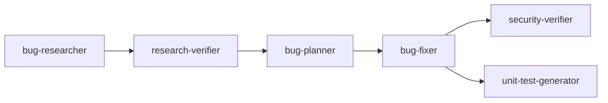

# Homework 4 — 4-Agent Pipeline

> **Student Name**: Volodymyr Kiryakov
> **AI Tools Used**: Claude Code

A 4-agent (+2 supporting) pipeline that finds, verifies, plans, fixes, and
tests bugs and security issues in a small sample Express app, run end-to-end
with a single command.

## Overview

The pipeline runs 6 stages against the sample **Notes API** (`src/`), each a
headless Claude Code agent defined in `agents/*.agent.md`:

| Stage | Agent | Model | Output |
|---|---|---|---|
| 1 | `bug-researcher` | sonnet | `context/bugs/001/research/codebase-research.md` |
| 2 | `research-verifier` | **opus** | `context/bugs/001/research/verified-research.md` |
| 3 | `bug-planner` | sonnet | `context/bugs/001/implementation-plan.md` |
| 4 | `bug-fixer` | sonnet | `context/bugs/001/fix-summary.md` (+ edits `src/`) |
| 5 | `security-verifier` | **opus** | `context/bugs/001/security-report.md` |
| 6 | `unit-test-generator` | sonnet | `context/bugs/001/test-report.md` (+ new tests in `tests/`) |

**Model choice rationale**: `research-verifier` and `security-verifier` get
the stronger reasoning model (opus) because their entire job is judgment
under ambiguity — catching a fabricated `file:line`, a subtly wrong root
cause, or a non-obvious vulnerability is a reasoning-heavy task where a
mistake poisons everything downstream (per
[`skills/research-quality-measurement.md`](skills/research-quality-measurement.md)'s
hard-fail rule). `bug-researcher`, `bug-planner`, `bug-fixer`, and
`unit-test-generator` do more mechanical, well-specified work (grep/read,
templating a plan, applying a specified diff, writing tests against a
checklist) where sonnet is fast and sufficient.

Two supporting skills define the rubrics agents must follow:

- [`skills/research-quality-measurement.md`](skills/research-quality-measurement.md) — used by `research-verifier` to rate research HIGH/MEDIUM/LOW.
- [`skills/unit-tests-FIRST.md`](skills/unit-tests-FIRST.md) — used by `unit-test-generator` (Fast, Independent, Repeatable, Self-validating, Timely).

## Sample application

`src/` is a small in-memory Express "Notes API" (`POST/GET/PATCH/DELETE /api/notes`,
search, pagination, export, admin bulk-delete) seeded with:

- 2 functional bugs: pagination off-by-one, case-sensitive search.
- 3 security issues: OS command injection in `/export`, mass-assignment on
  `PATCH /:id`, a hardcoded admin secret.

See [`context/bugs/001/bug-context.md`](context/bugs/001/bug-context.md) for
the seeded bug report the pipeline was run against.

## Running it

See [`HOWTORUN.md`](HOWTORUN.md).

## Results of the last pipeline run (bug 001)

- **Research Quality**: **HIGH** (pass) — see `context/bugs/001/research/verified-research.md`.
- **Fixes applied**: 7 changes, all in `src/routes/notes.js` — see
  `context/bugs/001/fix-summary.md`. `Overall Status: success`.
- **Security re-scan**: `context/bugs/001/security-report.md` — 0 CRITICAL,
  1 HIGH (pre-existing, out-of-scope missing authN/authZ, flagged for a
  future pass), 1 MEDIUM, 4 LOW, 1 INFO.
- **Tests**: `context/bugs/001/test-report.md` — 18 new regression/FIRST
  tests added across `tests/notes-bug-001.test.js` and
  `tests/notes-export-security.test.js`. Full suite: **23/23 passing**
  (`npm test`).

## AI tooling notes

Built iteratively with Claude Code: agent/skill files were hand-specified
(reviewed and adjusted before saving), the sample app and its seeded
bugs/vulnerabilities were generated and manually verified by hand-exploiting
each one (curl-based PoCs) before the pipeline ran, and the orchestrator
script (`run-pipeline.sh`) was written to chain the agents via headless
`claude -p` calls. The actual bug-finding, fixing, and testing in
`context/bugs/001/` was produced by the agents themselves in an unattended
run, not hand-written.
